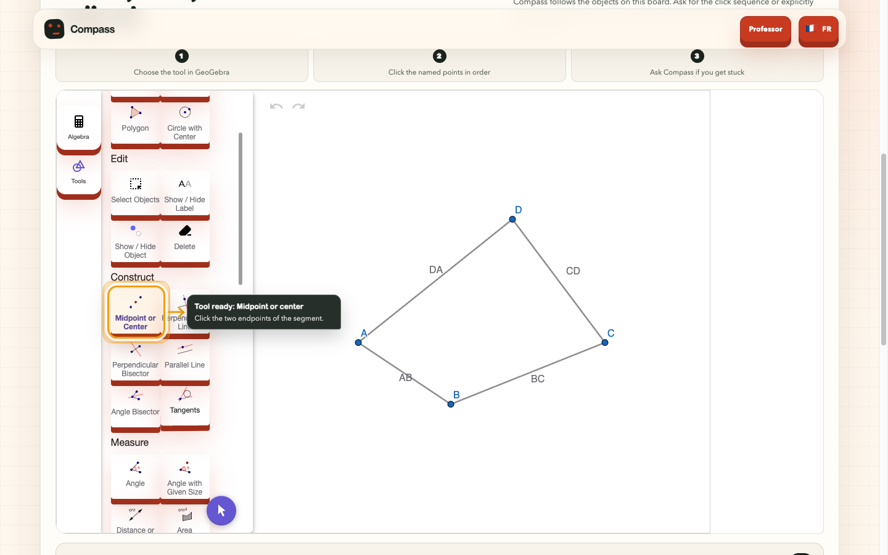

# Compass

Compass is a bilingual, real-time AI learning tutor. In its flagship geometry
experience, students investigate the Varignon theorem in GeoGebra while an
animated voice coach observes a bounded world, verifies supported relations
deterministically, and provides contextual guidance through closed semantic
actions.

Compass est un prototype Education qui accompagne l'élève sans lui retirer la
main. La démo publique ouvre en un clic une investigation Varignon préparée par
le professeur : l'élève construit, explore, conjecture et justifie dans le vrai
applet GeoGebra, avec un coach vocal ou texte qui sait montrer précisément
l'outil, l'objet ou la zone dont il parle.

**[Ouvrir la démo publique](https://compass-geotutor-demo.vercel.app/)**



## Ce que montre la démo

- **Un départ immédiat** : une seule action ouvre l'activité Varignon exacte,
  sans compte, code de classe, pseudonyme ou écriture serveur préalable.
- **Neuf missions progressives** : construire les quatre milieux, explorer les
  cas convexe, concave et croisé, conjecturer, justifier puis transférer.
- **Un vrai monde GeoGebra borné** : objets, dépendances, ownership, epoch,
  révision et faits sont stabilisés avant toute décision pédagogique.
- **Des validations honnêtes** : les relations compatibles sont calculées par
  l'application. Le modèle ne vérifie pas la géométrie et n'attribue pas les XP.
- **Un coach qui prend l'initiative avec mesure** : à la connexion, après une
  mission ou lors d'un blocage qualifié, Compass peut poser une question,
  conseiller ou choisir une action d'interface O2 réversible.
- **Un guidage visuel précis** : halo, pointeur et appel textuel ciblent le vrai
  bouton GeoGebra, un point, un segment ou une zone. Les pixels sont dérivés du
  DOM et du monde géométrique; ils ne viennent jamais du modèle.
- **Une mascotte fluide et factuelle** : une pose stable et des micro-mouvements
  CSS remplacent le défilement image par image. Écoute, réflexion, parole,
  outil, indice et célébration reflètent seulement des états applicatifs réels.
- **Une expérience accessible** : interface EN/FR, clavier, zoom 200 %,
  mouvement réduit et layouts qualifiés à 390, 768 et 1440 px.

## Les frontières de confiance

Compass sépare strictement la conversation, les actions visibles et les preuves.

| Niveau | Exemples | Autorité |
|---|---|---|
| Dialogue | Question, explication, relance courte | Le modèle formule; l'application décide quand une occasion de parler existe |
| Guidage O2 | Activer un outil, surligner, cadrer et pointer | Actions fermées, non constructives, budgétées, annulables et restaurées au cleanup |
| Mutation O3–O5 | Variation, restauration, démonstration | Consentement ou confirmation, cible fermée, rollback et vérification déterministe |
| Preuve et XP | Milieu, parallélisme, configuration, progression | Application uniquement; aucune sortie modèle ne complète une mission |

Le harnais expose onze actions sémantiques sous niveaux O0 à O5. Il n'existe ni
commande GeoGebra arbitraire, ni clic DOM libre, ni coordonnée de pointage
choisie par le modèle. Un geste ou une reprise de parole de l'élève annule le
travail du coach en cours.

## Capacités disponibles hors du golden path

La page publique reste volontairement simple, mais le dépôt contient aussi :

- un parcours photo générique qui lit un exercice scolaire, demande une
  confirmation humaine puis ouvre un tutorat conversationnel honnête;
- un studio professeur qui produit au plus un brouillon IA structuré, le rend
  éditable et exige une relecture avant publication;
- un catalogue d'exercices éphémère et un bilan de session factuel sans nom,
  texte libre ni note;
- une boucle classe pilote avec identité professeur limitée, codes rotatifs,
  élèves pseudonymes, affectations Varignon ciblées et PostgreSQL 16;
- les bancs spécialisés historiques de médiatrice, invariance, reset et
  restauration exacte, conservés pour les qualifications internes.

Ces capacités ne sont pas empilées sur l'accueil du jury et ne transforment pas
Compass en LMS.

## Rôle des modèles

| Besoin | Modèle | Frontière |
|---|---|---|
| Lire une photo d'exercice élève | `gpt-5.6-terra` | Un appel serveur, image en mémoire, `store:false`, outils vides, sortie stricte |
| Préparer un brouillon professeur | `gpt-5.6-luna` | Un appel maximum, effort faible, `store:false`, outils vides, sortie stricte |
| Tutorat voix/texte | `gpt-realtime-2.1` | WebRTC; profil général sans outil ou profil investigation à fonctions fermées |
| Relations, preuves et XP | Aucun modèle | Moteur TypeScript déterministe, contrats versionnés et ledger local |

Les consignes professeur, le texte extrait et les observations GeoGebra restent
des données non fiables. Ils ne peuvent pas modifier le prompt système, les
permissions, les preuves ou les règles de score.

## Architecture

Le runtime est une application Next.js App Router TypeScript sous
`apps/frontend`. Les routes serveur conservent les secrets hors du navigateur;
le client orchestre GeoGebra, WebRTC, la progression et les contrôleurs
d'annulation. Adapter, gateway, moteur de faits, checkpoints, policy et arbitre
restent des autorités distinctes derrière des contrats Zod fermés.

La démo directe construit localement une publication
`geometry_investigation.v1` validée et monte le même
`GeometryInvestigationRuntime` que le parcours professeur. Elle n'utilise ni
runtime parallèle ni raccourci de validation. L'audio distant peut alimenter un
unique niveau RMS local et éphémère pour la bouche de Compass; aucun sample,
transcript ou historique audio n'est stocké.

La mémoire reste la règle pour la démo, les médias, les XP et les rapports. La
base PostgreSQL est réservée à la boucle classe pilote et échoue fermée si sa
configuration manque. La reprise persistante du checkpoint sémantique reste
une tranche distincte encore incomplète.

Voir [l'architecture détaillée](docs/ARCHITECTURE.md), la
[roadmap](docs/ROADMAP.md), les [décisions](agents/DECISIONS.md) et le
[contrat de données classe](docs/CLASSROOM_DATA_CONTRACT.md).

## Installation locale

Prérequis : Node.js 22.17.x et pnpm 10.6.3.

```sh
corepack enable
pnpm install --frozen-lockfile
cp .env.example .env
pnpm dev
```

Ouvrir <http://localhost:3000>. `OPENAI_API_KEY` est optionnelle pour les
chemins locaux et déterministes, mais requise pour la lecture photo, le
brouillon professeur et les sessions Realtime. Elle doit rester serveur-only :
ne jamais la préfixer par `NEXT_PUBLIC_` ni la committer.

La classe pilote est désactivée par défaut. Son activation exige PostgreSQL,
les migrations et les secrets décrits dans le
[runbook classe](docs/CLASSROOM_PILOT_RUNBOOK.md); aucun fallback mémoire n'est
autorisé en Production.

## Vérification reproductible

```sh
pnpm test:docs:t0
pnpm lint
pnpm typecheck
pnpm test
pnpm build
pnpm --dir apps/frontend exec playwright test --grep-invert @live
```

Le dernier candidat fonctionnel qualifié rend 102 cartes documentaires,
899/899 tests Vitest sur 106 fichiers, lint, typecheck et build verts. Le gate
ciblé du parcours direct et de la mascotte rend 5/5 scénarios Playwright.

Les gates credentialed restent séparés : ils exigent une clé, un certificat et
une piste audio hors dépôt.

```sh
GEOTUTOR_TLS_CERT=/path/to/cert.pem \
GEOTUTOR_TLS_KEY=/path/to/key.pem \
pnpm gate:t6:live
```

Le [runbook de démonstration](docs/DEMO_RUNBOOK.md) distingue le harness local,
le microphone physique et le certificat de confiance. Les réserves live
historiques restent explicites dans `agents/TODO_NEXT.md`.

## Production publique

Le projet Vercel isolé `compass-geotutor-demo` sert l'alias HTTPS stable :
[compass-geotutor-demo.vercel.app](https://compass-geotutor-demo.vercel.app/).
La release animée et guidée est READY sous le déploiement
`dpl_62Q7d7DXTQoyaT3LtSmSkndPZMNz`.

L'alias s'ouvre sans code applicatif. Une règle Vercel WAF limite toutefois les
`POST /api/*` à six requêtes par fenêtre de soixante secondes et par IP, avant
l'exécution des fonctions. Les sessions professeur et élèves du pilote restent
des frontières d'authentification séparées. Voir le
[runbook d'accès public](docs/DEMO_ACCESS_RUNBOOK.md).

## Limites assumées

- Compass ne vérifie automatiquement que les relations couvertes par un contrat
  déterministe compatible; ailleurs, le tutorat reste conversationnel.
- La démo publique n'est ni un LMS, ni une notation à enjeu élevé, ni un dossier
  élève persistant.
- La classe pilote existe, mais la reprise persistante de la progression
  GeoGebra n'est pas encore qualifiée et le quota WAF global doit être segmenté
  avant un pilote multi-élèves derrière un même NAT.
- Les textes de démarche et de transfert ne sont ni notés ni transmis au
  professeur; médias, transcripts et Base64 ne sont pas persistés.
- Les fonctionnalités live dépendent des credentials, du navigateur, du
  microphone et des services externes; les fallbacks ne se présentent jamais
  comme une session live.
- GeoGebra est utilisé pour ce prototype non commercial avec attribution. Un
  usage commercial exige un accord distinct.

## Candidature

Le dossier prêt à adapter se trouve dans
[`docs/DEVPOST_SUBMISSION.md`](docs/DEVPOST_SUBMISSION.md). Il contient la copie
de soumission, le parcours jury, un script vidéo inférieur à trois minutes et
la checklist des actions qui restent sous responsabilité humaine.
