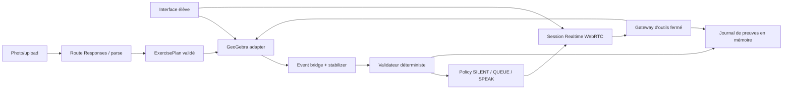

# Architecture cible GeoTutor

## État réel au 14 juillet 2026

Le dépôt contient un runtime Next.js App Router TypeScript sous `apps/frontend`,
un workspace pnpm, des tests et les quatre gates lint/typecheck/test/build.
Le spike GeoGebra épinglé sur `5.4.920.0` charge Geometry, crée A/B/AB et relit
leur état via l'API. `POST /api/realtime/session` valide une offre SDP et prépare
le relais serveur multipart vers `/v1/realtime/calls`. Le client WebRTC possède
micro, audio distant, `oai-events` et cleanup idempotent, y compris Stop pendant
permission micro ou négociation SDP. La preuve live OpenAI confirme peer/ICE,
data channel, audio distant, événements de réponse et fermeture complète. Les
deux spikes restent opérationnels ou dégradés indépendamment.

## Frontières cibles

## Responsabilités

- Interface navigateur : photo, micro, transcript, contrôles, progrès local et applet.
- Route Realtime : validation SDP, secret serveur et création de l'appel WebRTC.
- Route exercise parse : normalisation image, Responses API et sortie structurée.
- Adaptateur GeoGebra : seul composant autorisé à traduire les intentions produit en appels API.
- Event bridge : actions étudiantes terminées, snapshot stable et meaningful delta.
- Validateur : preuves numériques et tolérances applicatives.
- Policy : autorité exclusive des interventions proactives.
- Gateway : validation, permissions, budgets, révisions et idempotence des outils.
- Session state : exercice, objets, actions, interaction, checkpoints et evidence IDs en mémoire.

## Flux Realtime cible

1. Le navigateur crée une offre SDP et le data channel `oai-events`.
2. La route serveur transmet SDP et configuration à `/v1/realtime/calls` avec la clé standard.
3. `server_vad` détecte la parole mais `create_response:false` laisse l'application décider du tour.
4. Une intervention proactive n'existe que lorsque la policy retourne `SPEAK`.
5. Un appel d'outil terminé est validé, exécuté, renvoyé comme `function_call_output`, puis le tour se poursuit.
6. Les outils obsolètes ou non autorisés n'atteignent jamais l'adaptateur.

## Flux GeoGebra cible

1. Initialiser uniquement les givens confirmés.
2. Accumuler les updates et finaliser sur add/remove ou mouvement terminé.
3. Attendre deux snapshots canoniques identiques.
4. Vérifier les propriétés et mettre à jour l'UI localement.
5. Décider ensuite seulement d'une éventuelle intervention.

## Sécurité et données

- Clé OpenAI standard uniquement côté serveur.
- Pas de commande GeoGebra générique exposée au modèle.
- Pas de base de données, Files API ou stockage navigateur persistant.
- Images et checkpoints conservés en mémoire puis supprimés.
- Logs expurgés : aucun audio brut, image, SDP complet, clé ou donnée personnelle.
- Les actions visibles et destructives sont séparées par permissions et confirmations.

## Éléments non implémentés

Tous les composants ci-dessus sont des cibles contractuelles. Leur implémentation commence à T0-C02 et progresse selon `docs/ROADMAP.md`.
