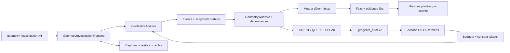
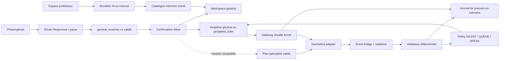

# Architecture cible GeoTutor

## État réel au 16 juillet 2026

Le dépôt contient un runtime Next.js App Router TypeScript sous `apps/frontend`,
un workspace pnpm, des tests et les quatre gates lint/typecheck/test/build.
Le spike GeoGebra épinglé sur `5.4.920.0` charge Geometry, crée A/B/AB et relit
leur état via l'API. `POST /api/realtime/session` valide une offre SDP et prépare
le relais serveur multipart vers `/v1/realtime/calls`. Le client WebRTC possède
micro, audio distant, `oai-events` et cleanup idempotent, y compris Stop pendant
permission micro ou négociation SDP. La preuve live OpenAI confirme peer/ICE,
data channel, audio distant, événements de réponse et fermeture complète. Les
deux spikes restent opérationnels ou dégradés indépendamment.

T1 ajoute une façade GeoGebra à cycle de vie et listeners centralisés, une scène
transactionnelle A/B/AB avec ownership, des snapshots canoniques non localisés,
un bridge d'actions stabilisées, deux preuves déterministes de médiatrice, le
progrès local accessible et un checkpoint Base64 en mémoire. Reset invalide les
travaux en vol, restaure le hash initial, réinscrit exactement quatre listeners
et reconstruit la fixture canonique si le hash ou l'inventaire exhaustif diverge,
ou si le callback `setBase64` dépasse trois secondes.

T2 fixe côté serveur `gpt-realtime-2.1`; T14 aligne la voix sur `cedar`, avec
un effort faible. Le VAD reste explicite avec quatre outils produit à schémas
fermés dans le module spécialisé historique. Un gestionnaire de tours
déduplique les commits et possède seul les réponses initiales comme les
continuations. Chaque réponse transporte son `geotutor_turn_id`; les réponses
tardives ou non possédées sont rejetées avant la boucle d'outils. Le gateway
revalide arguments, phase réelle, révision et budgets, puis les handlers
s'appuient uniquement sur les services déterministes T1/T3. La
boucle Realtime exécute les seuls appels `completed`, corrèle les outputs par
`call_id`, publie aussi les erreurs sûres et sort explicitement de `tooling` si
la continuation est impossible. Barge-in et Stop couvrent les réponses pending,
actives et les outils en vol; ils envoient `response.cancel` avant
`output_audio_buffer.clear`, arrêtent l'audio local et invalident les résultats
tardifs.

T3 normalise désormais les images en mémoire et appelle Responses derrière une
route serveur fermée. Le client route les résultats dans un reducer pur,
resoumet au plus deux clarifications avec le même `File`, ignore les réponses
obsolètes et revalide le plan avant d'émettre un unique `ExerciseConfirmedV1`.
Cet événement est consommé par une initialisation GeoGebra sérialisée qui
n'accepte que le canevas vide ou le bootstrap exact, capture un checkpoint
éphémère, suspend les listeners et crée A(-3,0), B(3,0) et AB comme owners
`exercise`. Un échec restaure Base64, inventaire, registre et hash exacts; un
succès promeut seulement ensuite la nouvelle baseline de Reset. Initialisation,
rollback, Reset UI et récupération passent par la même file du service
d'initialisation; un Reset demandé pendant une transaction attend donc sa fin.
Un rollback invérifiable gèle les nouvelles écritures jusqu'au reset de
récupération.
Le flux photo ne possède aucun stockage applicatif persistant : le serveur
normalise, construit la data URL et appelle Responses en mémoire avec
`store:false`, `tools:[]` et des réponses HTTP privées no-store, puis écrase ses
buffers et libère ses références en `finally`. Son logger, silencieux par
défaut, est une frontière runtime strictement allowlistée sans payload ni texte.
Côté client, Object URLs, parses en vol, File, clarification, extraction, plan
et confirmation sont nettoyés à leur dernière utilisation; seul le plan confirmé
nécessaire à un Retry transactionnel peut survivre à un échec. Reset, nouveau
draft et unmount invalident ce plan. Les fenêtres de smoke restent en mémoire et
ne contiennent ni image, data URL ni plan.

La couverture T3 s'appuie sur neuf feuilles synthétiques versionnées, produites
par Sharp et liées à un manifeste `FixtureExpectationV1` avec provenance, hash,
outcome et invariants. Les tests déterministes décodent réellement JPEG, PNG,
WebP, orientation EXIF, corruption et spoof avant une Responses mockée. Une eval
credentialed séparée réutilise le profil exact de la route, exclut les deux
rejets précoces, rapporte seulement modèle, request IDs, outcomes et invariants,
et ne promeut jamais automatiquement une sortie live en golden.

T4 ajoute un reducer pédagogique pur ancré à epoch, exercice, étape, révision
et hash, puis un delta qui ne compte que les objets élève et les faits
déterministes. La policy locale `SILENT | QUEUE | SPEAK` rend le progrès avant
tout effet distant : une première erreur reste silencieuse et un second blocage
identique peut produire une question L1. Les tours explicites et proactifs
partagent un unique gate de réponse; chaque directive est immuable et re-gardée
avant item, réponse et outil.

L'assistance explicite monte du plus bas niveau utile L1 à L4. L3/L4 sont des
composites applicatifs temporaires avec helpers `owner:"hint"`, restauration en
`finally` et confirmation one-shot liée à la révision pour L4. Un coordinateur
commun annule pending, réponse, outil et hint sur drag, parole, Stop, reset ou
nouvelle révision. Il ordonne `response.cancel` puis
`output_audio_buffer.clear`, coupe l'audio local si le clear échoue et bloque
les nouveaux envois jusqu'au retour à un état cohérent. Un journal append-only
en mémoire corrèle action, décision, directive, response, call et evidence IDs
via une allowlist qui exclut texte, audio, image, SDP et secret.

T5-C01 ajoute le contrat interne `run_invariance_test` sous
`lib/invariance`. Ses cinq paramètres normalisés
`[-1,-0.5,0,0.5,1]` sont versionnés et non choisis par le modèle. Le composite
relit candidat, révision, score 2/2 et deux preuves canoniques avant et après
chaque délégation; il retourne soit cinq samples finis avec cinq evidence IDs
uniques, soit aucun sample sur entrée invalide, stale, exception ou annulation.
T5-C02 enveloppe désormais ces cinq appels dans un unique
`InvarianceSceneService`. Il capture Base64, hash canonique, inventaire,
ownership, empreinte des seuls objets élève et listeners, arrête le bridge puis
offre un scope `gtInv_<runId_normalisé>_*` qui pré-enregistre tout helper comme
`temporary`. Le cleanup nominal supprime en ordre inverse et ne rend la main
qu'après égalité stricte; collision, exception, annulation ou divergence passent
par `setBase64`, reconstruction du registre et réconciliation des listeners.
T5-C03 fournit cette délégation avec un `GeoGebraInvarianceSampler`. P reste
contraint à la candidate; la base des positions est la projection du milieu de
AB sur cette droite, leur direction est unitaire et leur échelle versionnée est
`Distance(A,B)`. Les cinq paramètres C01 sont appliqués dans l'ordre par
`setCoords`; deux lectures concordantes à `1e-9` sont requises dans une fenêtre
de huit. Les coordonnées et PA/PB doivent être finies, P doit rester à moins de
`1e-6` de la droite et le pass utilise la tolérance absolue v1 de `1e-6`.
GeoGebra 5.4.920.0 refusant les labels commençant par `_`, le namespace C02
réservé est alphabétique (`gtInv_`). Le smoke vrai applet couvre 5/5 correct,
candidate décalée, stabilité et inventaire exact après cleanup. C01 à C03
n'élargissent pas la whitelist Realtime existante.
T5-C04 reçoit ce résultat dans un coordinator local-first sans transport. Il
rend un view-model des cinq mesures, attend l'acquittement, revalide le `runId`,
la révision, l'autorité 2/2 et les cinq preuves, puis consulte la policy
partagée. Un floor occupé retourne un `QUEUE` non finalisant; une intervention
ouverte garde la priorité. Seul un 5/5 courant produit au plus une directive
fermée L1 `generalize_invariance`, immuable et re-gardable avant dispatch via un
callback local. C04 n'émet aucun événement Realtime et n'implémente ni la
synthèse OOB C05 ni l'interface C06.
T5-C05 consomme ce résultat et cette directive dans un coordinateur Realtime
séparé. Il n'insère aucun item : son `response.create` porte un `event_id`,
`conversation:"none"`, un contexte `input` neuf limité aux cinq mesures et à
leurs evidence IDs, `output_modalities:["text"]`, `tools:[]`,
`tool_choice:"none"` et metadata string kind/runId/revision. Les maps event ID
et response ID isolent les réponses OOB concurrentes avant les filtres owners
des tours voix. Seul un `response.done` completed, hors conversation et composé
de parts `output_text` est rendu après un nouveau guard C04. Toute autre voie —
timeout, erreur, fermeture, send impossible, stale, statut non completed, texte
vide ou payload invalide — produit le même texte déterministe dérivé des cinq
mesures. C05 n'ajoute aucune surface React; l'affichage accessible reste C06.
T5-C06 ajoute `InvarianceExperiment`, une surface React à états fermés idle,
running, completed, failed et cancelled. Son interface runtime `start(observer)`
retourne le handle C01; le workspace la compose avec la scène C02, le sampler C03
et l'autorité 2/2 du validator existant. Les samples finis alimentent
progressivement le tableau PA/PB/delta/pass, tandis que `onResult` et `summary`
restent les frontières d'injection de C04/C05 sans dupliquer leurs coordinateurs
ou prétendre qu'une réponse Realtime existe. Cancel, reset, stale et unmount
annulent le handle courant. Les annonces sont groupées et dédupliquées, le focus
rejoint l'issue, les sorties partielles sont retirées et le mouvement décoratif
est supprimé sous `prefers-reduced-motion`.
T5-C07 relie ces frontières sans les fusionner : le workspace transmet au spike
Realtime une interface de requête, la session possède le coordinateur C05 et le
spike GeoGebra conserve l'autorité C04 et le contexte de run courant. Le rendu
terminal C06 est explicitement acquitté avant la policy; toute nouvelle action,
annulation, perte d'autorité ou unmount invalide résultat, directive et résumé.
Le renderer refuse aussi toute réponse tardive dont run ou révision ne sont plus
courants. Le gate vrai applet confirme hash global, empreinte élève, ownership,
inventaire, listeners et absence de helpers après succès, collision, annulation
et fallback. Une requête OOB déconnectée produit le fallback local; en live,
seules les modalités et parts de sortie font autorité pour le texte-only, car
`response.done` peut aussi ré-émettre la configuration audio de la session sans
produire d'événement ni de part audio.

T6-C02 place `CapabilityMode{kind,reason,since}` au-dessus du transport et ne
publie que `live_voice`, `typed_live` ou `scripted_local`. Le local est le défaut
sans appel modèle; toutes les opérations GeoGebra, validations et fallbacks
déterministes continuent. La voix exige session vérifiée, peer, data channel,
microphone et piste audio distante. Le texte réutilise le peer et `oai-events`
sans `getUserMedia`, avec `output_modalities:["text"]`, outils vides et réponse
rendue depuis `response.done`. Le schéma officiel et le smoke credentialed
montrent que `/v1/realtime/calls` attend les m-lines audio et application : le
texte ajoute donc une transceiver audio `inactive`, sans piste ni sortie; toute
piste distante échoue fermé. Une panne revient en local. Seul un clic dans un
état pédagogique sûr peut ouvrir une nouvelle session après un backoff observable
1/2/4/5 s plafonné, sans boucle automatique.

T6-C03 ajoute un `OperationArbiter` unique au workspace, partagé par GeoGebra et
Realtime. Il délivre des tokens immuables ancrés à epoch/révision pour seulement
quatre opérations et applique l'ordre reset > parole utilisateur > drag/action
> outil. Une autorité supérieure abort et retire les inférieures; une arrivée
inférieure est rejetée sans file ni reprise. Le pipeline d'action garde ses
commits UI et son émission proactive, la parole garde les transitions start/end,
la boucle outil compose le signal du gateway et garde mutation, output et
continuation, et le reset dédupliqué possède l'autorité maximale. Les quatre
frontières nommées sont `geogebra_mutation`, `ui_commit`, `realtime_emit` et
`tool_publish`. Timeout et watchdog quarantainent les résultats non coopératifs
sans attendre leur promesse. Une trace read-only bornée et sans payload rend
préemptions, commits et absence de pending inspectables; le journal corrélé de
démonstration reste T6-C04.

T6-C04 remplace le journal T4 par un contrat exporté fermé et versionné : chaque
entrée contient seulement timestamp, run, action optionnelle, révision, kind,
corrélations, statut et durée. Les corrélations acceptent uniquement operation,
directive, response, call et evidence IDs; action, décision SILENT/QUEUE/SPEAK,
directive, réponse, outil, preuve, annulation, capacité et quatre frontières C03
partagent ainsi la même chaîne. Les spans response/tool calculent leur durée.
Le ring buffer et les spans sont bornés à 512 entrées, les preuves à 32 IDs et
chaque éviction incrémente `dropped`. Les champs inconnus ne sont jamais copiés,
les champs requis invalides sont rejetés et les IDs optionnels trop longs sont
redactés. L'export debug est un snapshot immuable déclenché volontairement; il
n'est ni persisté ni envoyé. Reset réussi et fin de session Realtime vident le
journal, le compteur et les spans puis ouvrent un nouveau run.

T6-C05 unifie les erreurs des routes image et Realtime sous une enveloppe
`AppError` fermée, no-store et corrélable, sans lecture ni propagation du corps
amont sur erreur. Les SDK/relais n'ont aucun retry implicite : 401/403/429
restent sans retry automatique, 429 expose un backoff borné et 5xx a un unique
retry sous le timeout global. Un `LatencyBudgetMonitor` partagé par le workspace
conserve uniquement des durées bornées pour image, feedback local, session,
premier audio et outils; il publie p50/p95 et un fallback fermé, jamais les
entrées ou sorties mesurées. Les dépassements session/premier audio ferment le
transport et rendent le mode local explicite; le plafond outil couvre tout le
lot et bloque output/continuation tardifs. La table accessible reste
`unmeasured` tant qu'un chemin réel de la page ne l'a pas alimentée.

T6-C06 ajoute une frontière de présentation sans modifier les autorités
pédagogiques. Le build production peut être servi directement en HTTPS/TLS 1.2
avec certificat et clé fournis hors bundle; les headers limitent microphone et
caméra au same-origin. Un runbook distingue le certificat auto-signé du harness
et le certificat de confiance exigé sur la machine jury. La surface ajoute
skip-link, focus global visible, statuts programmatiques, reduced motion,
reflow multi-viewport et attributions GeoGebra/licence non-commerciale. Une
garde locale, bornée au codebase GeoGebra épinglé, rend inertes les sous-arbres
`aria-hidden`, normalise tab order, contrôles disabled, icônes décoratives et
panneau scrollable, puis restaure les attributs au cleanup. Axe inspecte ainsi
le vrai applet sans exclusion. Permission microphone ou service indisponible
conservent les modes C02 explicites et ne déclenchent aucune reprise automatique.

T6-C07 ajoute un gate de qualification sans nouvelle autorité produit. Le runner
calcule une empreinte des sources exécutables et une identité d'environnement
expurgée, réévalue les deux après préflight puis avant/après chaque run, exécute
lint, typecheck, Vitest, build et Playwright hors live, puis
lance trois workers live séquentiels, isolés et sans retry. Chaque manifest doit
contenir exactement neuf étapes fermées, du parse image réel au cleanup final;
toute erreur, preuve manquante ou dérive remet le compteur lié au candidat à
zéro. La session voix accepte uniquement le profil VAD strict. Si la création
initiale diffère seulement sur `create_response:true`, sa valeur serveur par
défaut, le client réaffirme une fois le profil par `session.update` et attend un
`session.updated` exact; toute autre divergence échoue fermé. Les artefacts sont
limités à 6 JSON schématisés, 3 captures PNG et 3 vidéos WEBM; `.last-run.json`
ou tout fichier inattendu invalide le gate. Les traces
réseau Playwright sont volontairement absentes puisqu'elles exposeraient le SDP
brut. Le certificat local et la piste micro synthétique du harness restent
explicitement distincts du certificat de confiance et du micro physique jury.

Le contre-audit final étend l'annulation globale à toute session Realtime dès
sa création, y compris `typed_live` et voix avant promotion. Reset envoie
l'annulation de réponse, ferme le transport et empêche tout rendu tardif. Son
lease est aussi propagé dans `CheckpointService` : chaque mutation, reprise de
listener et promotion de checkpoint revalide le watchdog après toute attente.

T7 ajoute uniquement une couche de présentation. `page.tsx` fournit le shell
produit et le parcours en trois étapes; `TutorWorkspace` conserve la composition
des runtimes existants mais ordonne photo, canvas, expérience et coach selon la
progression élève. Les diagnostics de fiabilité restent montés dans le même
workspace, derrière un `details` inspectable. Le système CSS non couché possède
la priorité sur la feuille legacy encapsulée, sans déplacer de logique métier.
Les libellés visibles peuvent être simplifiés tandis que les régions et noms
accessibles stables conservent les gates automatisés. Cette couche n'est donc
propriétaire d'aucun plan, checkpoint, lease, décision pédagogique, transport
ou stockage.

T8 place `LanguageProvider` au-dessus de cette composition. Ce contexte client
typé conserve uniquement `en | fr` en mémoire, expose une fonction de copie
bilingue et synchronise l'attribut `lang` du document; aucun cookie, storage,
route localisée ou package i18n n'est ajouté. `page.tsx` porte la marque publique
Compass et le bouton à drapeau de langue cible, puis les composants consomment
le même contexte pour traduire leurs libellés, états et noms accessibles sans
dupliquer les runtimes. Les sorties libres du modèle, contrats réseau, packages
`@geotutor/*` et globals `__GEOTUTOR_*` restent hors de cette couche afin de
préserver les autorités et preuves T1 à T7.

T9 ajoute une présence visuelle sans nouvelle autorité métier. Un atlas local
8 × 9 contient huit frames pour neuf états fermés. Un contrôleur React reçoit
les événements du flux photo, des callbacks Realtime, de la boucle outil et de
l'orchestrateur d'indices, applique une priorité déterministe puis revient à
`idle` au terminal, au reset ou au cleanup. Il n'analyse aucun transcript et ne
déclenche aucun effet GeoGebra ou réseau. Sous `prefers-reduced-motion`, la pose
initiale et le libellé d'état restent visibles sans lecture animée de l'atlas.

T10 sépare l'acquisition en deux contrôles : galerie sans attribut `capture` et
caméra mobile avec `capture="environment"`. Les deux convergent vers la même
normalisation en mémoire. Le lanceur racine charge la configuration serveur
avant Next.js sans exposer la clé au client.

T11 place `general_exercise.v1` devant les anciens templates spécialisés. La
route publique produit un énoncé et des tâches ordonnées pour toute matière
lisible; elle ne demande une clarification que si le contenu est illisible,
incomplet ou contradictoire. La confirmation explicite est l'unique autorité
qui rend ce contexte disponible au coach général.

Le workspace public rend l'enveloppe générique et garde le module médiatrice
masqué. Le mode `?specialist=geometry` conserve un banc explicite pour les tests
historiques et les futurs routages compatibles, sans modifier le défaut public.
Le profil Realtime `general_tutor` reçoit l'exercice confirmé dans un unique
`conversation.item.create` de rôle utilisateur. Les configurations voix et
texte imposent `tools:[]` et `tool_choice:"none"`; l'ajout du contexte ne
déclenche pas seul de `response.create`.

T12 place une machine d'écran locale au-dessus de cette composition. Le shell
rend exclusivement `landing`, `upload`, `confirm` ou `work` et conserve le
composant de confirmation monté entre acquisition et vérification pour ne pas
perdre le `File` en mémoire. Une transition déplace le focus vers le titre du
nouvel écran; elle ne modifie ni les contrats réseau ni l'autorité du clic de
confirmation.

Dans `work`, le profil général et la mascotte forment l'en-tête du poste de
travail. Les enveloppes dont la matière ou les notions indiquent mathématiques
ou géométrie montent un `GeoGebraScratchpad` vierge via l'adaptateur épinglé.
Cet applet n'enregistre aucun listener métier, ne reçoit aucune commande modèle
et n'alimente aucun score. Les tâches confirmées restent le seul guide visible;
les autres matières gardent le workspace générique. Le banc
`?specialist=geometry` continue de monter l'architecture historique complète.

T13 sépare le support mathématique du profil général. Le workbench desktop
devient une grille à deux colonnes : GeoGebra occupe la colonne principale et
sa hauteur suit le viewport; le coach compact puis les tâches occupent la
colonne latérale. Sous 980 px, l'ordre documentaire et visuel devient coach,
GeoGebra, tâches.

Le profil `geogebra_tutor` reçoit le même contexte confirmé non fiable, plus
quatre outils de fonction sémantiques. Un gateway dédié lit un inventaire borné
ou traduit uniquement un couple de points validés vers `Line`, `Ray` ou
`Segment`. Il conserve idempotence par `callId`, limite les appels et interdit
une seconde mutation dans le même tour. Aucun `evalCommand` fourni par le modèle
n'atteint l'adaptateur; le nom de commande est construit exclusivement par
l'application. Les outputs rejoignent la boucle Realtime existante avant une
continuation unique. Ce chemin assiste le geste, sans rejoindre le validateur
ni créer d'evidence de correction.

## T14 — atelier panoramique

T14-C01 remplace la grille latérale T13 par une scène à colonne unique. Le coach
est un bandeau horizontal, l'applet occupe toute la largeur utile et le rail de
missions reste fixé en bas du viewport. Le rail reçoit seulement un ensemble
d'indices vérifiés; son score dérive de cet ensemble et ne dépend ni d'un timer,
ni d'une inférence du modèle.

La garde d'accessibilité GeoGebra observe aussi `class`, `hidden` et `style`,
mais ne pose `inert` que lorsqu'un élément est réellement absent du rendu. Cela
préserve les contrôles visibles auxquels GeoGebra peut attribuer
`aria-hidden=true` pour sa propre gestion interne. La mascotte de bandeau est un
asset raster transparent dédié; la mascotte flottante conserve l'atlas local,
mais chaque activité non idle parcourt au plus huit frames avant de revenir au
repos. Aucun de ces changements n'élargit l'autorité du gateway T13.

T14-C02 ajoute un observateur au scratchpad général. Il lit au maximum quarante
objets, stabilise les événements GeoGebra et publie un snapshot puis les seuls
objets ajoutés, retirés ou modifiés dans la conversation active. Ces items sont
marqués comme observations applicatives, ne créent aucune réponse et ne valent
jamais autorisation de mutation.

Le validateur local reconnaît les cinq relations graphiques de l'exercice de
démonstration : E/F/G non alignés, droite FG verte, demi-droite EF bleue,
segment EG rouge et K sur la demi-droite au-delà de F. La progression reste
séquentielle et chaque preuve ajoute 20 XP; la réponse écrite finale reste en
attente. Le gateway compte désormais dix actions sémantiques strictes : lecture,
point, renommage, déplacement, style, droite, demi-droite, segment, cercle et
polygone. Le modèle ne reçoit toujours aucune commande GeoGebra libre.

## T15 — gamification transversale

T15 ajoute un ledger React mémoire indexé par confirmation et tâche. Une
déclaration élève vaut 10 XP; une preuve locale peut porter le même crédit à
20 XP sans double comptage. Le score de session traverse les exercices mais pas
le rechargement. GeoGebra n'affiche aucun bouton d'auto-déclaration.

## T16 — espace professeur frugal

État : close `pass` au 16 juillet 2026; le flux multi-onglet et les gates sont
validés, sans authentification ni persistance de production.

Le header route vers un atelier professeur distinct. Un formulaire accepte une
image ou un brief et appelle `/api/teacher/draft`. Cette route normalise l'image
si nécessaire puis effectue au plus un appel Responses `gpt-5.6-luna`, effort
faible, `store:false`, outils vides et Structured Outputs. Le brouillon est
ensuite contrôlé localement selon quatre vues sans modèle : cohérence
didactique, difficulté, sécurité et budget.

Après relecture, `/api/teacher/exercises` publie le contrat strict dans un store
mémoire borné à 64 éléments. La bibliothèque élève lit ce même store et démarre
le workspace général sans nouvelle extraction. Les consignes professeur sont
ajoutées au contexte Realtime comme données non fiables : elles orientent la
pédagogie mais ne peuvent modifier le prompt système, les outils ou les preuves.
Ce store est une preuve de flux multi-session sur un processus, pas une gestion
de classes ni une persistance de production.

T16-C02 ne modifie aucune de ces frontières. La surface professeur traduit ce
pipeline en trois tâches — choisir, préciser, partager — et ne rend ni modèle,
budget d'appel, schéma, route ou détail de persistance. Le contrôle de coût
reste dans `reviewTeacherExerciseDraft`; React rend seulement les trois
résultats utiles à la relecture enseignante.

## T17 — déploiement de démonstration Vercel

Le runtime `apps/frontend` est aussi déployé dans le projet isolé
`compass-geotutor-demo` avec le preset Vercel `nextjs`. La clé OpenAI est une
variable sensible des environnements Preview et Production; elle n'est pas
incluse dans les sorties statiques. Le domaine stable HTTPS sert la page et les
quatre fonctions App Router, tandis que les URLs immuables de déploiement restent
protégées par le SSO de l'équipe.

Ce déploiement ne change aucune autorité produit et ne transforme pas les stores
mémoire en persistance. À T17, l'alias stable était public pour les démos live
sans code ni quota; T24 ajoute ensuite ces deux protections avant sa
qualification publique.

## T18 — boucle Education jugeable

Le workspace élève garde localement le texte court fourni avant une
auto-déclaration et la réponse de transfert finale. Ces textes ne rejoignent ni
Realtime, ni une route serveur, ni l'espace professeur. Le ledger reçoit les
10 XP seulement après la première trace; les 20 XP restent exclusivement issus
des preuves déterministes déjà existantes.

Pour un exercice issu de la bibliothèque professeur, `TutorWorkspace` dérive un
`learning_session_report.v1` fermé des états locaux. `page.tsx` conserve le
dernier bilan par publication dans la mémoire React de l'onglet et le transmet à
`TeacherWorkspace`. Le rapport ne contient ni identifiant élève, ni réponse,
ni transcript, ni note : seulement compteurs, XP, statuts et timestamp. Le même
état React conserve aussi les publications créées dans l'onglet et les fusionne
avec le GET du catalogue, afin que la démo reste continue lorsqu'une fonction
serverless suivante ne partage pas le processus du POST.

Cette boucle n'est pas un LMS. Un rechargement efface bilans et secours local;
un autre appareil ou onglet n'est pas synchronisé. Le store serveur T16 reste
une preuve éphémère multi-requête lorsque le processus est partagé.

État : T18-C01 close `pass` au 16 juillet 2026 avec 677/677 Vitest, 36/36
Playwright hors live, build et validation de 69 cartes. T20 publie ce candidat
sur l'alias Vercel stable depuis le SHA Git `e1efc28`.

## T20 — Production T18 sur Vercel

Le déploiement part d'un worktree Git propre plutôt que du workspace principal
contenant des captures générées. La racine de build effective reste
`apps/frontend`; le projet Vercel isolé conserve le preset Next.js et est aligné
sur Node 22.x, conformément aux engines du dépôt.

La Production `dpl_3ng7jmgj727Yy1Mu8w9SABuXv7R5` est READY et sert
`https://compass-geotutor-demo.vercel.app/`. La page, le mode GeoGebra et le
catalogue professeur répondent avec les headers sécurité/no-store attendus. Le
smoke mobile vérifie le formulaire professeur, la note de démarche avant XP,
les six missions GeoGebra, l'absence de débordement et une console sans erreur.
À cette étape historique, le déploiement ne créait aucune persistance ni
protection d'accès; T24 les ajoute ensuite sans modifier le store mémoire.

## T21 — PRD du harnais d'investigation GeoGebra

T21-C01 est une tranche documentaire close `pass` au 17 juillet 2026. Elle ne
modifie aucun runtime et définit dans
`docs/PRD_GEOGEBRA_INVESTIGATION_HARNESS.md` la cible T22 : contrat
`geometry_investigation.v1`, actions O0 à O5, monde v2, moteur déterministe,
preuves expérimentales, checkpoints publics et parcours Varignon.

L'audit distingue désormais trois réalités : le scratchpad public T14 sait
observer un monde borné et exécuter dix actions simples ; le spécialiste
historique possède checkpoints, highlights, preuves et restauration plus
riches ; T22 doit composer ces briques derrière une façade publique unique sans
présenter la cible comme déjà livrée.

## T22 — harnais unifié, C01-C08 closes

T22-C01 introduit `GeometryInvestigationRuntime` sans retirer le fallback
généraliste. La façade validée compose adapter, observation, moteur, gateway,
checkpoints, policy et callbacks sans exposer encore de mutation publique. Les
contrats stricts activité, monde v2, faits, captures et bilan, ainsi que les
fixtures Varignon FR/EN à neuf missions, sont la source unique des cartes
suivantes. Les cartes C02 à C07 complètent progressivement cette façade : monde
et dépendances stabilisés, calcul des faits, progression des missions, actions
sémantiques autorisées et états restaurables. L'assemblage public reste réservé
à C08.

Varignon est le seul template obligatoire du MVP. Le scaffold contient A, B,
C, D et les côtés. L'élève construit E, F, G, H, capture les configurations
convexe, concave et croisée, formule une conjecture, vérifie deux parallélismes
par capture puis suit une justification fondée sur le théorème des milieux.
Une capture assistant est distincte d'une capture élève et ne crédite jamais la
manipulation demandée.

T22-C02 ajoute le parse borné des parents, l'ownership, le monde et le delta v2,
ainsi qu'un stabilisateur à double snapshot. `movingGeos` et les updates
intermédiaires ne publient rien; un terminal add/remove/update/drag/sélection ou
undo/redo ne commit qu'après deux mondes identiques. Une méthode Realtime v2
envoie ces observations sans réponse automatique. Le scratchpad ne l'active que
par le flag de qualification `t22WorldV2=1`; le parcours public reste v1.

T22-C03 ajoute un moteur pur à tolérances versionnées. Il classe quatre points
ordonnés en convexe, concave, croisé ou dégénéré et évalue milieu, parallèle,
perpendiculaire, égalité de longueurs, appartenance, non-alignement et
parallélogramme. Les faits restent liés à l'epoch, la révision et le hash du
monde; un `unknown` ne devient jamais une preuve. Le parallélogramme compose les
deux faits parallèles déclarés. Le flag `t22Engine=1` sert uniquement à la
qualification sur le vrai applet.

T22-C04 ajoute un gateway strict réutilisable par le tool loop. Sept actions
modèle sont négociées sous le header v2 ; l'initialisation reste système. Le
gateway revalide activité, epoch, révision, mission et niveau O0-O5, applique les
budgets 4/2/1 et consomme un token one-shot avant toute variation O3. `setMode`,
highlight et focus sont réversibles ; les coordonnées de variation sont choisies
localement et tout drag concurrent provoque rollback/quarantaine. Le flag
`t22Actions=1` sert au vrai applet ; le profil public reste historique.

T22-C05 étend la palette à dix actions avec capture, restore et démonstration.
Un store mémoire borne huit états/12 MB, garde le Base64 privé et expose une
galerie textuelle. Le restore suspend et réconcilie les listeners, vérifie hash,
inventaire et ownership sous une nouvelle autorité, puis tente une baseline
avant fatal. Le replay déclaré offre pause/reprise/stop et rend toujours la
figure exacte sans crédit élève. Avant `setBase64`, une barrière `inert` rend
l'annulation transactionnelle; une écriture engagée reste atomique jusqu'à la
réconciliation. Le flag `t22Evidence=1` qualifie ces garanties sur le vrai
applet sans bascule publique.

T22-C06 ajoute une machine de session pure dérivée de l'activité. Elle avance
les neuf missions dans l'ordre à partir de faits courants, de captures élève et
de traces locales de réflexion ; les captures assistant et les textes du modèle
ne portent aucun crédit. La policy `SILENT | QUEUE | SPEAK` garde le premier
blocage silencieux, borne les aides L1-L4 et publie vers Realtime seulement un
contexte pédagogique fermé. Le rapport anonyme exclut conjecture, transfert et
identité. Le flag `t22Learning=1` qualifie le parcours complet sur le vrai
applet, jusqu'à 160 XP déterministes.

T22-C07 ajoute une publication v2 strictement discriminée, un studio professeur
avec vraie prévisualisation et une session élève ouverte depuis le contrat exact.
Le rapport anonyme circule seulement dans la session éphémère multi-onglet et
reste sans identité, note ni texte libre.

T22-C08 rend cette composition publique uniquement pour une publication au
discriminant compatible. Le scratchpad transmet le monde v2 évalué, la pédagogie
fermée et le `ToolRuntime` d'investigation à la session `geogebra_tutor`; le
contexte géométrique remplace alors le contexte général, sans modifier les
profils historiques. Unmount ferme observer, adapter, checkpoints et globals.

T22-C01 à C08 sont closes `pass` après contre-audit final sans P1/P2 ouvert.
Trois runs consécutifs sur le même candidat et environnement prouvent contrat
exact, L4 sous consentement, barrière de restore, 9/9, 160 XP, zéro helper,
quotas, accessibilité, reflow et cleanup. Le smoke credentialed prouve la
négociation v2, l'inspection sans mutation et la fermeture du canal.

## Frontières cibles

## Responsabilités

- Interface navigateur : photo, confirmation, tâches ordonnées, micro, texte,
  contrôles et modules spécialisés compatibles.
- Route Realtime : validation SDP, secret serveur et création de l'appel WebRTC.
- Route exercise parse : normalisation image, Responses API et sortie structurée.
- Adaptateur GeoGebra : seul composant autorisé à traduire les intentions produit en appels API.
- Event bridge : actions étudiantes terminées, snapshot stable et meaningful delta.
- Validateur : preuves numériques et tolérances applicatives.
- Policy : autorité exclusive des interventions proactives.
- Gateway : validation, permissions, budgets, révisions et idempotence des outils.
- Session state : exercice général confirmé et, seulement dans un module
  compatible, objets, actions, checkpoints et evidence IDs en mémoire.

## Flux Realtime cible

1. Le navigateur crée une offre SDP et le data channel `oai-events`.
2. La route serveur transmet SDP et configuration à `/v1/realtime/calls` avec la clé standard.
3. `server_vad` détecte la parole mais `create_response:false` laisse l'application décider du tour.
4. Une intervention proactive n'existe que lorsque la policy retourne `SPEAK`.
5. Un appel d'outil terminé est validé, exécuté, renvoyé comme `function_call_output`, puis `VoiceTurnManager` poursuit le tour une seule fois après tous les outputs.
6. Les outils obsolètes ou non autorisés n'atteignent jamais l'adaptateur.
7. Une reprise de parole ou Stop annule réponse pending/active, outils et audio avant tout nouveau tour.

## Flux GeoGebra cible

1. Initialiser uniquement les givens confirmés.
2. Accumuler les updates et finaliser sur add/remove ou mouvement terminé.
3. Attendre deux snapshots canoniques identiques.
4. Vérifier les propriétés et mettre à jour l'UI localement.
5. Décider ensuite seulement d'une éventuelle intervention.

## Sécurité et données

- Clé OpenAI standard uniquement côté serveur.
- Pas de commande GeoGebra générique exposée au modèle.
- Pas de base de données, Files API ou stockage navigateur persistant.
- Images et checkpoints conservés en mémoire puis supprimés.
- Logs expurgés : aucun audio brut, image, SDP complet, clé ou donnée personnelle.
- Les actions visibles et destructives sont séparées par permissions et confirmations.

## État livré et limites

Les frontières Realtime et GeoGebra, le gateway vocal T2, le flux photo T3, la
boucle pédagogique T4, le pipeline T5-C01 à T5-C07, le reset/recovery global
T6-C01, les trois modes T6-C02, l'arbitre T6-C03, le journal corrélé T6-C04,
le hardening erreurs/secrets/latence T6-C05, la qualification HTTPS/a11y C06 et
le gate live 3/3 C07 existent. La présentation élève T7 et la marque/interface
bilingue Compass T8 existent également sans déplacer ces autorités. Une autorité unique avance
l'epoch, attend les annulations, suspend le bridge, restaure et revalide
hash/inventaire/registre/listeners; elle
reconstruit seulement A/B/AB depuis le plan confirmé si le checkpoint mémoire
est absent ou corrompu, sinon elle publie un fatal réessayable. T6 à T8 ne
conservent plus de carte d'implémentation ouverte; les deux contre-audits QA
sont `pass`.
T9, T10, T11 et T12 sont également closes : mascotte locale, acquisition,
parcours généraliste puis navigation en écrans et atelier contextualisé sont
livrés. T13-C01 est close : GeoGebra est dominant et l'assistance sémantique
bornée est reliée aux modes voix et texte. T14-C01 et C02 sont closes : la scène
est panoramique, le monde borné alimente le coach, les cinq missions graphiques
progressent par preuve locale et la palette fermée couvre le renommage et les
constructions usuelles. Le tutorat transversal reste
conversationnel; la vérification déterministe automatique de toutes les
matières, la notation à enjeu élevé et la génération d'outils arbitraires ne
sont pas implémentées.
Le PRD T21 et le harnais T22 sont implémentés jusqu'à C08. Le parcours public
professeur prévisualise le scaffold réel avant publication; le parcours élève
construit dans le toolbar/canvas GeoGebra, stabilise et classe Varignon, tient
un ledger XP monotone, capture trois checkpoints et restaure par confirmation.
Les aides L1-L4 ne sont créditées qu'après livraison; les effets O2/O5 passent
par le gateway fermé et sont annulés sur sélection, drag ou parole élève. Le
gate C08 construit lui-même l'artefact, empreinte sources, `.next` et Chromium,
puis exige trois parcours UI consécutifs sans retry avec Axe incluant l'applet
et cleanup terminal. Comptes, classes, persistance, notation à enjeu élevé,
licence commerciale et déploiement restent hors de cette architecture locale.

## Architecture post-harnais — protection T24 implémentée, classe encore cible

T23 ne modifie pas le runtime. Il fixe la cible T24 à T27 afin que la boucle de
classe étende le harnais existant au lieu de créer une seconde autorité.

T24-C02 ajoute une frontière d'accès devant le runtime sans toucher aux
autorités pédagogiques T22. Le layout serveur remplace toute la surface par un
écran d'accès tant que le cookie signé n'est pas valide. La même vérification
enveloppe le catalogue professeur et, avant lecture du corps, Realtime, analyse
photo et brouillon professeur. En Production, l'absence de hash ou de secret retourne 503 et ne retombe
jamais vers un accès public. En amont, une règle Vercel WAF compte atomiquement
les `POST /api/*` par IP et retourne 429 avant les fonctions après six requêtes
sur soixante secondes. Le runbook opérationnel est
`docs/DEMO_ACCESS_RUNBOOK.md`.

T24-C03 sert cette architecture depuis le commit
`5493bd9d9b33dfec17eac7006b07230bfd3959c3`. La Production
`dpl_GQtBPXN765XSqrPLyJpakyUZsfen` est READY en `iad1`; l'alias stable répond
dynamiquement avec la porte d'accès et les headers privés. Le parcours public
publie et termine Varignon, tandis qu'un smoke Realtime texte négocie la palette
du harnais v2 sans micro ni mutation. Le store reste éphémère : T25 doit fermer
les contrats de données et d'accès avant toute persistance.

```mermaid
flowchart LR
    Teacher["Identité professeur pilote"] --> Classroom["Classe et aliases"]
    Teacher --> Intent["Intention pédagogique"]
    Intent --> Registry["Recettes Varignon versionnées"]
    Registry --> Generate["Proposition structurée bornée"]
    Generate --> Compile["Compilateur déterministe"]
    Compile --> Preflight["Préflight vrai harnais"]
    Preflight --> Approve["Approbation professeur"]
    Approve --> Assignment["Affectation immuable"]
    Classroom --> Assignment
    Assignment --> Queue["File et reprise élève"]
    Queue --> Runtime["GeometryInvestigationRuntime T22"]
    Runtime --> Facts["Faits minimaux persistants"]
    Facts --> Report["Bilan professeur factuel"]
    Report --> Intent
```

### Frontières nouvelles

- `ClassroomStore` : classes, codes hachés, aliases pseudonymes et révocation.
- `AssignmentStore` : activité compilée exacte, destinataires, dates et politique
  d'aide. Une affectation publiée est immuable.
- `LearningEvidenceStore` : missions, faits, configurations, assistance et
  statuts uniquement; aucun texte libre, média, transcript, note ou Base64.
- `VarignonVariantRegistry` : recette, version, difficulté, preset, transfert,
  capacités moteur et compilateur vers `geometry_investigation.v1` avec
  `template:"varignon.v1"` invariant.
- `AdaptiveDraftService` : un appel modèle maximum qui retourne seulement une
  recette Varignon connue et ses paramètres stricts.
- `TemplatePreflight` : compilation et exécution isolée sur le même runtime,
  avec cleanup vérifié avant prévisualisation.

Ces frontières restent cibles jusqu'à leurs cartes respectives. T25-C01 a fermé
le choix du store, les migrations, l'accès, l'expiration et la suppression avant
la première écriture persistante.

T25-C01 retient PostgreSQL 16 comme autorité persistante cible derrière le port
serveur `ClassroomStoreV1`. Les contraintes applicatives Zod précèdent le driver;
les clés étrangères, unicités et cascades constituent la seconde barrière SQL.
`MemoryClassroomStoreV1` fixe la sémantique en test et `pg-mem` exécute la
migration up/down sans créer de ressource cloud. Le contrat complet est
`docs/CLASSROOM_DATA_CONTRACT.md`.

### Flux de données autorisé

1. Le professeur authentifié crée une classe et distribue un code rotatif.
2. L'élève rejoint sous pseudonyme; aucune identité scolaire n'est demandée.
3. Une affectation référence un contrat compilé, versionné et approuvé.
4. La reprise relit un checkpoint court seulement après validation du contrat,
   de la version, du hash et de l'ownership.
5. Le runtime produit les faits comme aujourd'hui; une projection allowlistée
   seulement devient persistante.
6. Le bilan agrège les faits et les aides, sans inférer une maîtrise ni une note.
7. Le profil de difficultés reste explicable et peut alimenter un nouveau
   brouillon, que le professeur doit à nouveau approuver.

### Invariants de migration

- T24-C01 a intégré T22 dans `main` et T24-C02 a fermé l'accès et le budget;
  T24-C03 a déployé ce candidat protégé; T25-C01 a fermé les données et accès
  avant toute persistance et T25-C02 peut ouvrir la boucle de classe.
- Aucun nouveau composant n'appelle directement l'API GeoGebra hors adapter et
  gateway existants.
- Aucun second template n'est accepté avant le pilote; les neuf missions et les
  relations de `varignon.v1` restent invariantes.
- Aucun modèle ne reçoit de checkpoint, scène brute ou texte libre élève.
- Aucun modèle ne publie, n'affecte ou ne complète une mission.
- Chaque entité persistante possède propriétaire, durée de conservation et
  suppression en cascade testée.
- Le mode catalogue éphémère T22 reste un fallback jusqu'à migration explicite;
  il ne doit pas être silencieusement mélangé au store de classe.
