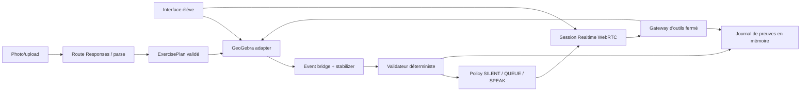

# Architecture cible GeoTutor

## État réel au 15 juillet 2026

Le dépôt contient un runtime Next.js App Router TypeScript sous `apps/frontend`,
un workspace pnpm, des tests et les quatre gates lint/typecheck/test/build.
Le spike GeoGebra épinglé sur `5.4.920.0` charge Geometry, crée A/B/AB et relit
leur état via l'API. `POST /api/realtime/session` valide une offre SDP et prépare
le relais serveur multipart vers `/v1/realtime/calls`. Le client WebRTC possède
micro, audio distant, `oai-events` et cleanup idempotent, y compris Stop pendant
permission micro ou négociation SDP. La preuve live OpenAI confirme peer/ICE,
data channel, audio distant, événements de réponse et fermeture complète. Les
deux spikes restent opérationnels ou dégradés indépendamment.

T1 ajoute une façade GeoGebra à cycle de vie et listeners centralisés, une scène
transactionnelle A/B/AB avec ownership, des snapshots canoniques non localisés,
un bridge d'actions stabilisées, deux preuves déterministes de médiatrice, le
progrès local accessible et un checkpoint Base64 en mémoire. Reset invalide les
travaux en vol, restaure le hash initial, réinscrit exactement quatre listeners
et reconstruit la fixture canonique si le hash ou l'inventaire exhaustif diverge,
ou si le callback `setBase64` dépasse trois secondes.

T2 fixe côté serveur `gpt-realtime-2.1`, la voix `marin`, l'effort faible, le
VAD explicite et quatre outils produit à schémas fermés. Un gestionnaire de tours
déduplique les commits et possède seul les réponses initiales comme les
continuations. Chaque réponse transporte son `geotutor_turn_id`; les réponses
tardives ou non possédées sont rejetées avant la boucle d'outils. Le gateway
revalide arguments, phase réelle, révision et budgets, puis les handlers
s'appuient uniquement sur les services déterministes T1/T3. La
boucle Realtime exécute les seuls appels `completed`, corrèle les outputs par
`call_id`, publie aussi les erreurs sûres et sort explicitement de `tooling` si
la continuation est impossible. Barge-in et Stop couvrent les réponses pending,
actives et les outils en vol; ils envoient `response.cancel` avant
`output_audio_buffer.clear`, arrêtent l'audio local et invalident les résultats
tardifs.

T3 normalise désormais les images en mémoire et appelle Responses derrière une
route serveur fermée. Le client route les résultats dans un reducer pur,
resoumet au plus deux clarifications avec le même `File`, ignore les réponses
obsolètes et revalide le plan avant d'émettre un unique `ExerciseConfirmedV1`.
Cet événement est consommé par une initialisation GeoGebra sérialisée qui
n'accepte que le canevas vide ou le bootstrap exact, capture un checkpoint
éphémère, suspend les listeners et crée A(-3,0), B(3,0) et AB comme owners
`exercise`. Un échec restaure Base64, inventaire, registre et hash exacts; un
succès promeut seulement ensuite la nouvelle baseline de Reset. Initialisation,
rollback, Reset UI et récupération passent par la même file du service
d'initialisation; un Reset demandé pendant une transaction attend donc sa fin.
Un rollback invérifiable gèle les nouvelles écritures jusqu'au reset de
récupération.
Le flux photo ne possède aucun stockage applicatif persistant : le serveur
normalise, construit la data URL et appelle Responses en mémoire avec
`store:false`, `tools:[]` et des réponses HTTP privées no-store, puis écrase ses
buffers et libère ses références en `finally`. Son logger, silencieux par
défaut, est une frontière runtime strictement allowlistée sans payload ni texte.
Côté client, Object URLs, parses en vol, File, clarification, extraction, plan
et confirmation sont nettoyés à leur dernière utilisation; seul le plan confirmé
nécessaire à un Retry transactionnel peut survivre à un échec. Reset, nouveau
draft et unmount invalident ce plan. Les fenêtres de smoke restent en mémoire et
ne contiennent ni image, data URL ni plan.

La couverture T3 s'appuie sur neuf feuilles synthétiques versionnées, produites
par Sharp et liées à un manifeste `FixtureExpectationV1` avec provenance, hash,
outcome et invariants. Les tests déterministes décodent réellement JPEG, PNG,
WebP, orientation EXIF, corruption et spoof avant une Responses mockée. Une eval
credentialed séparée réutilise le profil exact de la route, exclut les deux
rejets précoces, rapporte seulement modèle, request IDs, outcomes et invariants,
et ne promeut jamais automatiquement une sortie live en golden.

T4 ajoute un reducer pédagogique pur ancré à epoch, exercice, étape, révision
et hash, puis un delta qui ne compte que les objets élève et les faits
déterministes. La policy locale `SILENT | QUEUE | SPEAK` rend le progrès avant
tout effet distant : une première erreur reste silencieuse et un second blocage
identique peut produire une question L1. Les tours explicites et proactifs
partagent un unique gate de réponse; chaque directive est immuable et re-gardée
avant item, réponse et outil.

L'assistance explicite monte du plus bas niveau utile L1 à L4. L3/L4 sont des
composites applicatifs temporaires avec helpers `owner:"hint"`, restauration en
`finally` et confirmation one-shot liée à la révision pour L4. Un coordinateur
commun annule pending, réponse, outil et hint sur drag, parole, Stop, reset ou
nouvelle révision. Il ordonne `response.cancel` puis
`output_audio_buffer.clear`, coupe l'audio local si le clear échoue et bloque
les nouveaux envois jusqu'au retour à un état cohérent. Un journal append-only
en mémoire corrèle action, décision, directive, response, call et evidence IDs
via une allowlist qui exclut texte, audio, image, SDP et secret.

T5-C01 ajoute le contrat interne `run_invariance_test` sous
`lib/invariance`. Ses cinq paramètres normalisés
`[-1,-0.5,0,0.5,1]` sont versionnés et non choisis par le modèle. Le composite
relit candidat, révision, score 2/2 et deux preuves canoniques avant et après
chaque délégation; il retourne soit cinq samples finis avec cinq evidence IDs
uniques, soit aucun sample sur entrée invalide, stale, exception ou annulation.
T5-C02 enveloppe désormais ces cinq appels dans un unique
`InvarianceSceneService`. Il capture Base64, hash canonique, inventaire,
ownership, empreinte des seuls objets élève et listeners, arrête le bridge puis
offre un scope `gtInv_<runId_normalisé>_*` qui pré-enregistre tout helper comme
`temporary`. Le cleanup nominal supprime en ordre inverse et ne rend la main
qu'après égalité stricte; collision, exception, annulation ou divergence passent
par `setBase64`, reconstruction du registre et réconciliation des listeners.
T5-C03 fournit cette délégation avec un `GeoGebraInvarianceSampler`. P reste
contraint à la candidate; la base des positions est la projection du milieu de
AB sur cette droite, leur direction est unitaire et leur échelle versionnée est
`Distance(A,B)`. Les cinq paramètres C01 sont appliqués dans l'ordre par
`setCoords`; deux lectures concordantes à `1e-9` sont requises dans une fenêtre
de huit. Les coordonnées et PA/PB doivent être finies, P doit rester à moins de
`1e-6` de la droite et le pass utilise la tolérance absolue v1 de `1e-6`.
GeoGebra 5.4.920.0 refusant les labels commençant par `_`, le namespace C02
réservé est alphabétique (`gtInv_`). Le smoke vrai applet couvre 5/5 correct,
candidate décalée, stabilité et inventaire exact après cleanup. C01 à C03
n'élargissent pas la whitelist Realtime existante.
T5-C04 reçoit ce résultat dans un coordinator local-first sans transport. Il
rend un view-model des cinq mesures, attend l'acquittement, revalide le `runId`,
la révision, l'autorité 2/2 et les cinq preuves, puis consulte la policy
partagée. Un floor occupé retourne un `QUEUE` non finalisant; une intervention
ouverte garde la priorité. Seul un 5/5 courant produit au plus une directive
fermée L1 `generalize_invariance`, immuable et re-gardable avant dispatch via un
callback local. C04 n'émet aucun événement Realtime et n'implémente ni la
synthèse OOB C05 ni l'interface C06.
T5-C05 consomme ce résultat et cette directive dans un coordinateur Realtime
séparé. Il n'insère aucun item : son `response.create` porte un `event_id`,
`conversation:"none"`, un contexte `input` neuf limité aux cinq mesures et à
leurs evidence IDs, `output_modalities:["text"]`, `tools:[]`,
`tool_choice:"none"` et metadata string kind/runId/revision. Les maps event ID
et response ID isolent les réponses OOB concurrentes avant les filtres owners
des tours voix. Seul un `response.done` completed, hors conversation et composé
de parts `output_text` est rendu après un nouveau guard C04. Toute autre voie —
timeout, erreur, fermeture, send impossible, stale, statut non completed, texte
vide ou payload invalide — produit le même texte déterministe dérivé des cinq
mesures. C05 n'ajoute aucune surface React; l'affichage accessible reste C06.
T5-C06 ajoute `InvarianceExperiment`, une surface React à états fermés idle,
running, completed, failed et cancelled. Son interface runtime `start(observer)`
retourne le handle C01; le workspace la compose avec la scène C02, le sampler C03
et l'autorité 2/2 du validator existant. Les samples finis alimentent
progressivement le tableau PA/PB/delta/pass, tandis que `onResult` et `summary`
restent les frontières d'injection de C04/C05 sans dupliquer leurs coordinateurs
ou prétendre qu'une réponse Realtime existe. Cancel, reset, stale et unmount
annulent le handle courant. Les annonces sont groupées et dédupliquées, le focus
rejoint l'issue, les sorties partielles sont retirées et le mouvement décoratif
est supprimé sous `prefers-reduced-motion`.
T5-C07 relie ces frontières sans les fusionner : le workspace transmet au spike
Realtime une interface de requête, la session possède le coordinateur C05 et le
spike GeoGebra conserve l'autorité C04 et le contexte de run courant. Le rendu
terminal C06 est explicitement acquitté avant la policy; toute nouvelle action,
annulation, perte d'autorité ou unmount invalide résultat, directive et résumé.
Le renderer refuse aussi toute réponse tardive dont run ou révision ne sont plus
courants. Le gate vrai applet confirme hash global, empreinte élève, ownership,
inventaire, listeners et absence de helpers après succès, collision, annulation
et fallback. Une requête OOB déconnectée produit le fallback local; en live,
seules les modalités et parts de sortie font autorité pour le texte-only, car
`response.done` peut aussi ré-émettre la configuration audio de la session sans
produire d'événement ni de part audio.

T6-C02 place `CapabilityMode{kind,reason,since}` au-dessus du transport et ne
publie que `live_voice`, `typed_live` ou `scripted_local`. Le local est le défaut
sans appel modèle; toutes les opérations GeoGebra, validations et fallbacks
déterministes continuent. La voix exige session vérifiée, peer, data channel,
microphone et piste audio distante. Le texte réutilise le peer et `oai-events`
sans `getUserMedia`, avec `output_modalities:["text"]`, outils vides et réponse
rendue depuis `response.done`. Le schéma officiel et le smoke credentialed
montrent que `/v1/realtime/calls` attend les m-lines audio et application : le
texte ajoute donc une transceiver audio `inactive`, sans piste ni sortie; toute
piste distante échoue fermé. Une panne revient en local. Seul un clic dans un
état pédagogique sûr peut ouvrir une nouvelle session après un backoff observable
1/2/4/5 s plafonné, sans boucle automatique.

T6-C03 ajoute un `OperationArbiter` unique au workspace, partagé par GeoGebra et
Realtime. Il délivre des tokens immuables ancrés à epoch/révision pour seulement
quatre opérations et applique l'ordre reset > parole utilisateur > drag/action
> outil. Une autorité supérieure abort et retire les inférieures; une arrivée
inférieure est rejetée sans file ni reprise. Le pipeline d'action garde ses
commits UI et son émission proactive, la parole garde les transitions start/end,
la boucle outil compose le signal du gateway et garde mutation, output et
continuation, et le reset dédupliqué possède l'autorité maximale. Les quatre
frontières nommées sont `geogebra_mutation`, `ui_commit`, `realtime_emit` et
`tool_publish`. Timeout et watchdog quarantainent les résultats non coopératifs
sans attendre leur promesse. Une trace read-only bornée et sans payload rend
préemptions, commits et absence de pending inspectables; le journal corrélé de
démonstration reste T6-C04.

T6-C04 remplace le journal T4 par un contrat exporté fermé et versionné : chaque
entrée contient seulement timestamp, run, action optionnelle, révision, kind,
corrélations, statut et durée. Les corrélations acceptent uniquement operation,
directive, response, call et evidence IDs; action, décision SILENT/QUEUE/SPEAK,
directive, réponse, outil, preuve, annulation, capacité et quatre frontières C03
partagent ainsi la même chaîne. Les spans response/tool calculent leur durée.
Le ring buffer et les spans sont bornés à 512 entrées, les preuves à 32 IDs et
chaque éviction incrémente `dropped`. Les champs inconnus ne sont jamais copiés,
les champs requis invalides sont rejetés et les IDs optionnels trop longs sont
redactés. L'export debug est un snapshot immuable déclenché volontairement; il
n'est ni persisté ni envoyé. Reset réussi et fin de session Realtime vident le
journal, le compteur et les spans puis ouvrent un nouveau run.

T6-C05 unifie les erreurs des routes image et Realtime sous une enveloppe
`AppError` fermée, no-store et corrélable, sans lecture ni propagation du corps
amont sur erreur. Les SDK/relais n'ont aucun retry implicite : 401/403/429
restent sans retry automatique, 429 expose un backoff borné et 5xx a un unique
retry sous le timeout global. Un `LatencyBudgetMonitor` partagé par le workspace
conserve uniquement des durées bornées pour image, feedback local, session,
premier audio et outils; il publie p50/p95 et un fallback fermé, jamais les
entrées ou sorties mesurées. Les dépassements session/premier audio ferment le
transport et rendent le mode local explicite; le plafond outil couvre tout le
lot et bloque output/continuation tardifs. La table accessible reste
`unmeasured` tant qu'un chemin réel de la page ne l'a pas alimentée.

T6-C06 ajoute une frontière de présentation sans modifier les autorités
pédagogiques. Le build production peut être servi directement en HTTPS/TLS 1.2
avec certificat et clé fournis hors bundle; les headers limitent microphone et
caméra au same-origin. Un runbook distingue le certificat auto-signé du harness
et le certificat de confiance exigé sur la machine jury. La surface ajoute
skip-link, focus global visible, statuts programmatiques, reduced motion,
reflow multi-viewport et attributions GeoGebra/licence non-commerciale. Une
garde locale, bornée au codebase GeoGebra épinglé, rend inertes les sous-arbres
`aria-hidden`, normalise tab order, contrôles disabled, icônes décoratives et
panneau scrollable, puis restaure les attributs au cleanup. Axe inspecte ainsi
le vrai applet sans exclusion. Permission microphone ou service indisponible
conservent les modes C02 explicites et ne déclenchent aucune reprise automatique.

T6-C07 ajoute un gate de qualification sans nouvelle autorité produit. Le runner
calcule une empreinte des sources exécutables et une identité d'environnement
expurgée, réévalue les deux après préflight puis avant/après chaque run, exécute
lint, typecheck, Vitest, build et Playwright hors live, puis
lance trois workers live séquentiels, isolés et sans retry. Chaque manifest doit
contenir exactement neuf étapes fermées, du parse image réel au cleanup final;
toute erreur, preuve manquante ou dérive remet le compteur lié au candidat à
zéro. La session voix accepte uniquement le profil VAD strict. Si la création
initiale diffère seulement sur `create_response:true`, sa valeur serveur par
défaut, le client réaffirme une fois le profil par `session.update` et attend un
`session.updated` exact; toute autre divergence échoue fermé. Les artefacts sont
limités à 6 JSON schématisés, 3 captures PNG et 3 vidéos WEBM; `.last-run.json`
ou tout fichier inattendu invalide le gate. Les traces
réseau Playwright sont volontairement absentes puisqu'elles exposeraient le SDP
brut. Le certificat local et la piste micro synthétique du harness restent
explicitement distincts du certificat de confiance et du micro physique jury.

Le contre-audit final étend l'annulation globale à toute session Realtime dès
sa création, y compris `typed_live` et voix avant promotion. Reset envoie
l'annulation de réponse, ferme le transport et empêche tout rendu tardif. Son
lease est aussi propagé dans `CheckpointService` : chaque mutation, reprise de
listener et promotion de checkpoint revalide le watchdog après toute attente.

T7 ajoute uniquement une couche de présentation. `page.tsx` fournit le shell
produit et le parcours en trois étapes; `TutorWorkspace` conserve la composition
des runtimes existants mais ordonne photo, canvas, expérience et coach selon la
progression élève. Les diagnostics de fiabilité restent montés dans le même
workspace, derrière un `details` inspectable. Le système CSS non couché possède
la priorité sur la feuille legacy encapsulée, sans déplacer de logique métier.
Les libellés visibles peuvent être simplifiés tandis que les régions et noms
accessibles stables conservent les gates automatisés. Cette couche n'est donc
propriétaire d'aucun plan, checkpoint, lease, décision pédagogique, transport
ou stockage.

T8 place `LanguageProvider` au-dessus de cette composition. Ce contexte client
typé conserve uniquement `en | fr` en mémoire, expose une fonction de copie
bilingue et synchronise l'attribut `lang` du document; aucun cookie, storage,
route localisée ou package i18n n'est ajouté. `page.tsx` porte la marque publique
Compass et le bouton à drapeau de langue cible, puis les composants consomment
le même contexte pour traduire leurs libellés, états et noms accessibles sans
dupliquer les runtimes. Les sorties libres du modèle, contrats réseau, packages
`@geotutor/*` et globals `__GEOTUTOR_*` restent hors de cette couche afin de
préserver les autorités et preuves T1 à T7.

## Frontières cibles

## Responsabilités

- Interface navigateur : photo, micro, transcript, contrôles, progrès local et applet.
- Route Realtime : validation SDP, secret serveur et création de l'appel WebRTC.
- Route exercise parse : normalisation image, Responses API et sortie structurée.
- Adaptateur GeoGebra : seul composant autorisé à traduire les intentions produit en appels API.
- Event bridge : actions étudiantes terminées, snapshot stable et meaningful delta.
- Validateur : preuves numériques et tolérances applicatives.
- Policy : autorité exclusive des interventions proactives.
- Gateway : validation, permissions, budgets, révisions et idempotence des outils.
- Session state : exercice, objets, actions, interaction, checkpoints et evidence IDs en mémoire.

## Flux Realtime cible

1. Le navigateur crée une offre SDP et le data channel `oai-events`.
2. La route serveur transmet SDP et configuration à `/v1/realtime/calls` avec la clé standard.
3. `server_vad` détecte la parole mais `create_response:false` laisse l'application décider du tour.
4. Une intervention proactive n'existe que lorsque la policy retourne `SPEAK`.
5. Un appel d'outil terminé est validé, exécuté, renvoyé comme `function_call_output`, puis `VoiceTurnManager` poursuit le tour une seule fois après tous les outputs.
6. Les outils obsolètes ou non autorisés n'atteignent jamais l'adaptateur.
7. Une reprise de parole ou Stop annule réponse pending/active, outils et audio avant tout nouveau tour.

## Flux GeoGebra cible

1. Initialiser uniquement les givens confirmés.
2. Accumuler les updates et finaliser sur add/remove ou mouvement terminé.
3. Attendre deux snapshots canoniques identiques.
4. Vérifier les propriétés et mettre à jour l'UI localement.
5. Décider ensuite seulement d'une éventuelle intervention.

## Sécurité et données

- Clé OpenAI standard uniquement côté serveur.
- Pas de commande GeoGebra générique exposée au modèle.
- Pas de base de données, Files API ou stockage navigateur persistant.
- Images et checkpoints conservés en mémoire puis supprimés.
- Logs expurgés : aucun audio brut, image, SDP complet, clé ou donnée personnelle.
- Les actions visibles et destructives sont séparées par permissions et confirmations.

## Éléments non implémentés

Les frontières Realtime et GeoGebra, le gateway vocal T2, le flux photo T3, la
boucle pédagogique T4, le pipeline T5-C01 à T5-C07, le reset/recovery global
T6-C01, les trois modes T6-C02, l'arbitre T6-C03, le journal corrélé T6-C04,
le hardening erreurs/secrets/latence T6-C05, la qualification HTTPS/a11y C06 et
le gate live 3/3 C07 existent. La présentation élève T7 et la marque/interface
bilingue Compass T8 existent également sans déplacer ces autorités. Une autorité unique avance
l'epoch, attend les annulations, suspend le bridge, restaure et revalide
hash/inventaire/registre/listeners; elle
reconstruit seulement A/B/AB depuis le plan confirmé si le checkpoint mémoire
est absent ou corrompu, sinon elle publie un fatal réessayable. T6 à T8 ne
conservent plus de carte d'implémentation ouverte; les deux contre-audits QA
sont `pass`.
La prochaine action est uniquement la préparation physique de la machine jury.
