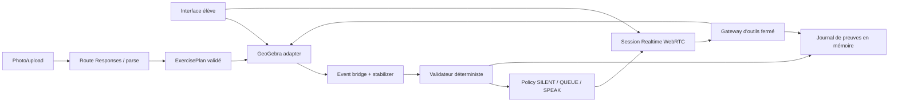

# Architecture cible GeoTutor

## État réel au 14 juillet 2026

Le dépôt contient un runtime Next.js App Router TypeScript sous `apps/frontend`,
un workspace pnpm, des tests et les quatre gates lint/typecheck/test/build.
Le spike GeoGebra épinglé sur `5.4.920.0` charge Geometry, crée A/B/AB et relit
leur état via l'API. `POST /api/realtime/session` valide une offre SDP et prépare
le relais serveur multipart vers `/v1/realtime/calls`. Le client WebRTC possède
micro, audio distant, `oai-events` et cleanup idempotent, y compris Stop pendant
permission micro ou négociation SDP. La preuve live OpenAI confirme peer/ICE,
data channel, audio distant, événements de réponse et fermeture complète. Les
deux spikes restent opérationnels ou dégradés indépendamment.

T1 ajoute une façade GeoGebra à cycle de vie et listeners centralisés, une scène
transactionnelle A/B/AB avec ownership, des snapshots canoniques non localisés,
un bridge d'actions stabilisées, deux preuves déterministes de médiatrice, le
progrès local accessible et un checkpoint Base64 en mémoire. Reset invalide les
travaux en vol, restaure le hash initial, réinscrit exactement quatre listeners
et reconstruit la fixture canonique si le hash ou l'inventaire exhaustif diverge,
ou si le callback `setBase64` dépasse trois secondes.

T2 fixe côté serveur `gpt-realtime-2.1`, la voix `marin`, l'effort faible, le
VAD explicite et quatre outils produit à schémas fermés. Un gestionnaire de tours
déduplique les commits et possède seul les réponses initiales comme les
continuations. Chaque réponse transporte son `geotutor_turn_id`; les réponses
tardives ou non possédées sont rejetées avant la boucle d'outils. Le gateway
revalide arguments, phase réelle, révision et budgets, puis les handlers
s'appuient uniquement sur les services déterministes T1/T3. La
boucle Realtime exécute les seuls appels `completed`, corrèle les outputs par
`call_id`, publie aussi les erreurs sûres et sort explicitement de `tooling` si
la continuation est impossible. Barge-in et Stop couvrent les réponses pending,
actives et les outils en vol; ils envoient `response.cancel` avant
`output_audio_buffer.clear`, arrêtent l'audio local et invalident les résultats
tardifs.

T3 normalise désormais les images en mémoire et appelle Responses derrière une
route serveur fermée. Le client route les résultats dans un reducer pur,
resoumet au plus deux clarifications avec le même `File`, ignore les réponses
obsolètes et revalide le plan avant d'émettre un unique `ExerciseConfirmedV1`.
Cet événement est consommé par une initialisation GeoGebra sérialisée qui
n'accepte que le canevas vide ou le bootstrap exact, capture un checkpoint
éphémère, suspend les listeners et crée A(-3,0), B(3,0) et AB comme owners
`exercise`. Un échec restaure Base64, inventaire, registre et hash exacts; un
succès promeut seulement ensuite la nouvelle baseline de Reset. Initialisation,
rollback, Reset UI et récupération passent par la même file du service
d'initialisation; un Reset demandé pendant une transaction attend donc sa fin.
Un rollback invérifiable gèle les nouvelles écritures jusqu'au reset de
récupération.
Le flux photo ne possède aucun stockage applicatif persistant : le serveur
normalise, construit la data URL et appelle Responses en mémoire avec
`store:false`, `tools:[]` et des réponses HTTP privées no-store, puis écrase ses
buffers et libère ses références en `finally`. Son logger, silencieux par
défaut, est une frontière runtime strictement allowlistée sans payload ni texte.
Côté client, Object URLs, parses en vol, File, clarification, extraction, plan
et confirmation sont nettoyés à leur dernière utilisation; seul le plan confirmé
nécessaire à un Retry transactionnel peut survivre à un échec. Reset, nouveau
draft et unmount invalident ce plan. Les fenêtres de smoke restent en mémoire et
ne contiennent ni image, data URL ni plan.

La couverture T3 s'appuie sur neuf feuilles synthétiques versionnées, produites
par Sharp et liées à un manifeste `FixtureExpectationV1` avec provenance, hash,
outcome et invariants. Les tests déterministes décodent réellement JPEG, PNG,
WebP, orientation EXIF, corruption et spoof avant une Responses mockée. Une eval
credentialed séparée réutilise le profil exact de la route, exclut les deux
rejets précoces, rapporte seulement modèle, request IDs, outcomes et invariants,
et ne promeut jamais automatiquement une sortie live en golden.

T4 ajoute un reducer pédagogique pur ancré à epoch, exercice, étape, révision
et hash, puis un delta qui ne compte que les objets élève et les faits
déterministes. La policy locale `SILENT | QUEUE | SPEAK` rend le progrès avant
tout effet distant : une première erreur reste silencieuse et un second blocage
identique peut produire une question L1. Les tours explicites et proactifs
partagent un unique gate de réponse; chaque directive est immuable et re-gardée
avant item, réponse et outil.

L'assistance explicite monte du plus bas niveau utile L1 à L4. L3/L4 sont des
composites applicatifs temporaires avec helpers `owner:"hint"`, restauration en
`finally` et confirmation one-shot liée à la révision pour L4. Un coordinateur
commun annule pending, réponse, outil et hint sur drag, parole, Stop, reset ou
nouvelle révision. Il ordonne `response.cancel` puis
`output_audio_buffer.clear`, coupe l'audio local si le clear échoue et bloque
les nouveaux envois jusqu'au retour à un état cohérent. Un journal append-only
en mémoire corrèle action, décision, directive, response, call et evidence IDs
via une allowlist qui exclut texte, audio, image, SDP et secret.

## Frontières cibles

## Responsabilités

- Interface navigateur : photo, micro, transcript, contrôles, progrès local et applet.
- Route Realtime : validation SDP, secret serveur et création de l'appel WebRTC.
- Route exercise parse : normalisation image, Responses API et sortie structurée.
- Adaptateur GeoGebra : seul composant autorisé à traduire les intentions produit en appels API.
- Event bridge : actions étudiantes terminées, snapshot stable et meaningful delta.
- Validateur : preuves numériques et tolérances applicatives.
- Policy : autorité exclusive des interventions proactives.
- Gateway : validation, permissions, budgets, révisions et idempotence des outils.
- Session state : exercice, objets, actions, interaction, checkpoints et evidence IDs en mémoire.

## Flux Realtime cible

1. Le navigateur crée une offre SDP et le data channel `oai-events`.
2. La route serveur transmet SDP et configuration à `/v1/realtime/calls` avec la clé standard.
3. `server_vad` détecte la parole mais `create_response:false` laisse l'application décider du tour.
4. Une intervention proactive n'existe que lorsque la policy retourne `SPEAK`.
5. Un appel d'outil terminé est validé, exécuté, renvoyé comme `function_call_output`, puis `VoiceTurnManager` poursuit le tour une seule fois après tous les outputs.
6. Les outils obsolètes ou non autorisés n'atteignent jamais l'adaptateur.
7. Une reprise de parole ou Stop annule réponse pending/active, outils et audio avant tout nouveau tour.

## Flux GeoGebra cible

1. Initialiser uniquement les givens confirmés.
2. Accumuler les updates et finaliser sur add/remove ou mouvement terminé.
3. Attendre deux snapshots canoniques identiques.
4. Vérifier les propriétés et mettre à jour l'UI localement.
5. Décider ensuite seulement d'une éventuelle intervention.

## Sécurité et données

- Clé OpenAI standard uniquement côté serveur.
- Pas de commande GeoGebra générique exposée au modèle.
- Pas de base de données, Files API ou stockage navigateur persistant.
- Images et checkpoints conservés en mémoire puis supprimés.
- Logs expurgés : aucun audio brut, image, SDP complet, clé ou donnée personnelle.
- Les actions visibles et destructives sont séparées par permissions et confirmations.

## Éléments non implémentés

Les frontières Realtime et GeoGebra, le gateway vocal T2, le flux photo T3 et
la boucle pédagogique T4 existent. L'expérience d'invariance T5 et le hardening
T6 restent des cibles contractuelles selon `docs/ROADMAP.md`.
