# Plan produit post-harnais Compass

## Décision

Le harnais d'investigation GeoGebra n'est plus la prochaine fonctionnalité : il
est livré et qualifié dans T22. La priorité devient la boucle produit complète :

1. publier et protéger le candidat T22 ;
2. permettre à un professeur d'affecter une activité à une classe ou à un élève
   pseudonyme ;
3. produire des variantes adaptatives fermées de l'exercice Varignon ;
4. mesurer la valeur avec un petit pilote réel avant d'élargir le périmètre.

Cette séquence répond au cœur de Compass : l'IA ne remplace pas le professeur et
ne donne pas simplement un devoir à un élève autonome. Le professeur choisit
l'objectif, Compass propose des activités contrôlées, l'élève enquête dans
GeoGebra, puis le professeur reçoit des faits utiles pour décider de la suite.

## Point de départ audité

| Capacité | État au 17 juillet 2026 | Conséquence |
|---|---|---|
| Harnais `geometry_investigation.v1` | Livré et qualifié | Réutiliser le runtime, ne pas en créer un second |
| Varignon | Parcours professeur/élève complet | Activité unique de référence jusqu'au pilote |
| Observation et dépendances GeoGebra | Livrées | Les faux milieux et les faits géométriques sont distingués |
| Actions O0 à O5 | Livrées | Toute nouvelle activité conserve consentement, budgets et cleanup |
| Captures, restauration et replay | Livrés | Les preuves expérimentales restent réversibles et privées |
| Rapport professeur | Livré mais éphémère | Le persister sous forme factuelle et minimale dans T25 |
| Catalogue professeur | Éphémère | Le remplacer par des affectations bornées et persistantes |
| Classes et accès | Absents | Construire un pilote limité, pas un LMS complet |
| Génération adaptative | Absente | Générer une recette Varignon bornée, jamais des commandes libres |
| Profondeur pédagogique | Un parcours Varignon fixe | Varier étayage, difficulté, preset et transfert sans changer le théorème |
| Candidat public | Production encore alignée sur T18 | Intégrer, protéger et déployer T22 avant le pilote |

Les preuves T22 de référence sont : 829 tests Vitest, 43 tests Playwright hors
live, un smoke Realtime credentialed et trois golden journeys consécutifs sans
retry sur le candidat `candidate_b3bc38db342b359299dd3400`.

## Thèse produit

Compass doit devenir un atelier d'investigation géométrique orchestré par le
professeur :

- le professeur définit une intention pédagogique et une cible ;
- le système propose une recette Varignon compatible avec le moteur de preuve ;
- le professeur prévisualise et approuve avant affectation ;
- l'élève retrouve son travail, manipule GeoGebra et reçoit le plus petit niveau
  d'aide autorisé ;
- les faits observés alimentent un bilan, jamais une note automatique ;
- la prochaine activité est proposée au professeur à partir de difficultés
  déterministes, et non décidée silencieusement par le modèle.

L'expression « exercices infinis » signifie d'abord « variantes nombreuses,
bornées et vérifiables du même problème de Varignon », pas « génération
arbitraire de géométrie ou de commandes GeoGebra ».

## Principes non négociables

1. Une seule autorité géométrique : le harnais T22.
2. Une affirmation mathématique n'est vérifiée que par un fait déterministe.
3. Le modèle propose ; le compilateur local valide ; le professeur approuve.
4. Les élèves du pilote utilisent des pseudonymes et des codes d'invitation.
5. Aucun texte libre, audio, image, transcript ou Base64 GeoGebra n'entre dans
   le dossier d'apprentissage persistant.
6. Une activité affectée est versionnée et rejouable avec son contrat exact.
7. Le bilan décrit des faits et des aides ; il ne diagnostique pas une maîtrise
   et ne produit pas de note à enjeu élevé.
8. La démo publique est protégée et limitée avant diffusion.

## Parcours professeur cible

1. Le professeur s'identifie dans un espace pilote limité.
2. Il crée une classe, obtient un code d'invitation et ajoute des élèves sous
   pseudonyme.
3. Il choisit Varignon, un niveau d'étayage et une difficulté ciblée.
4. Compass propose une recette, un preset et un transfert stricts en un appel borné.
5. Le compilateur local rejette toute proposition hors contrat et exécute le
   préflight sur le vrai harnais.
6. Le professeur prévisualise, ajuste les formulations et la politique d'aide,
   puis approuve.
7. Il affecte l'activité à la classe, à un groupe ou à un élève.
8. Il consulte des bilans factuels et décide lui-même de la prochaine activité.

## Parcours élève cible

1. L'élève rejoint la classe avec un code et choisit son pseudonyme autorisé.
2. Il voit uniquement ses activités affectées et leur état.
3. Il ouvre l'activité exacte, reprend son dernier état sûr et enquête dans
   GeoGebra.
4. Compass observe les gestes terminés, vérifie les faits compatibles et dose
   l'aide selon la politique du professeur.
5. L'élève formule conjecture, justification et transfert localement ; seul le
   statut de complétion est persisté.
6. La session enregistre les faits nécessaires au bilan puis applique la durée
   de conservation prévue.

## Architecture produit cible

```mermaid
flowchart LR
    Teacher["Professeur"] --> Class["Classe pilote"]
    Teacher --> Intent["Intention pédagogique"]
    Intent --> Registry["Recettes Varignon versionnées"]
    Registry --> Draft["Proposition IA bornée"]
    Draft --> Compiler["Compilateur et préflight déterministes"]
    Compiler --> Preview["Prévisualisation professeur"]
    Preview --> Assignment["Affectation versionnée"]
    Class --> Assignment
    Assignment --> Queue["File de travail élève"]
    Queue --> Harness["Harnais GeoGebra T22"]
    Harness --> Evidence["Faits d'apprentissage minimaux"]
    Evidence --> Report["Bilan professeur factuel"]
    Report --> Intent
```

## Données persistantes minimales

| Entité | Contenu autorisé | Contenu interdit |
|---|---|---|
| `TeacherAccount` | identifiant, secret géré, préférences de langue | clé OpenAI, journal brut |
| `Classroom` | nom court, propriétaire, code haché, état | données administratives scolaires |
| `LearnerAlias` | pseudonyme, classe, statut d'accès | nom légal, email élève, date de naissance |
| `ActivityTemplate` | `varignon.v1`, recette, version, paramètres et capacités requises | autre template ou commande GeoGebra arbitraire |
| `Assignment` | destinataire, contrat exact, dates, politique d'aide | prompt modèle non borné |
| `LearningEvidence` | faits, missions, aide, timestamps bornés, version | texte libre, audio, image, transcript, Base64 |
| `SessionCheckpoint` | état sûr chiffré ou référence courte avec expiration | stockage sans limite ou exposition au modèle |

La tranche T25 doit choisir un stockage serveur adapté, définir les règles
d'accès, l'expiration et la suppression avant de persister la première donnée.

## Fabrique adaptative

La génération suit une chaîne fermée :

`intention professeur → sélection de recette Varignon → paramètres structurés →
validation de schéma → compilation locale → préflight GeoGebra → aperçu →
approbation → affectation`.

Le modèle n'émet jamais de commande GeoGebra et ne choisit aucun autre template.
Il remplit seulement des paramètres bornés : recette `guided`, `standard` ou
`challenge`, difficulté factuelle, preset local, formulation allowlistée,
politique d'aide et transfert `rectangle`, `rhombus` ou `square`. Les neuf
missions et les relations de Varignon restent invariantes. Un échec de
compilation revient à un brouillon manuel sûr ; il ne publie rien.

La matrice complète et ses invariants sont définis dans
`docs/VARIGNON_ACTIVITY_BLUEPRINT.md`. L'ajout d'un autre théorème est reporté
après le pilote, lorsque la valeur de la boucle classe est prouvée.

## Tranches et cartes

| Tranche | But | Cartes | Gate de sortie |
|---|---|---:|---|
| T23 | Aligner le produit après T22 | 2 | Plan post-harnais et blueprint Varignon cohérents |
| T24 | Publier et sécuriser le candidat T22 | 4 | Main propre, démo protégée, production qualifiée |
| T25 | Livrer la boucle classe et affectations | 6 | Un professeur affecte, un élève pseudonyme reprend, le bilan persiste |
| T26 | Livrer la fabrique Varignon adaptative | 6 | Matrice Varignon compilée et approbation obligatoire |
| T27 | Piloter et qualifier le produit | 4 | Pilote réel documenté et candidat final reproductible |

### T24 — Publication et sécurité

| Carte | Résultat |
|---|---|
| T24-C01 | Intégrer le candidat T22 dans `main` et figer une identité de release |
| T24-C02 | Protéger l'accès démo et limiter les routes coûteuses |
| T24-C03 | Déployer l'artefact exact et qualifier le parcours public |
| T24-C04 | Synchroniser la vidéo, la fiche Devpost et le dossier de soumission |

### T25 — Boucle classe

| Carte | Résultat |
|---|---|
| T25-C01 | Fermer contrats, modèle de données, accès et politique de rétention |
| T25-C02 | Créer classes, codes et roster pseudonyme |
| T25-C03 | Affecter une activité à une classe, un groupe ou un élève |
| T25-C04 | Afficher la file élève et reprendre une affectation |
| T25-C05 | Persister les faits et rendre un bilan professeur supprimable |
| T25-C06 | Qualifier le golden professeur → affectation → élève → bilan |

### T26 — Adaptation

| Carte | Résultat |
|---|---|
| T26-C01 | Créer le registre de recettes Varignon et son compilateur |
| T26-C02 | Calculer un profil de difficultés factuel et explicable |
| T26-C03 | Générer un brouillon strict en un appel borné |
| T26-C04 | Compiler et préflight toute variante avant aperçu |
| T26-C05 | Faire approuver et affecter la variante par le professeur |
| T26-C06 | Qualifier recettes, presets et transferts Varignon |

### T27 — Pilote et candidat final

| Carte | Résultat |
|---|---|
| T27-C01 | Durcir accès, secrets, rétention et suppression en production |
| T27-C02 | Ajouter instrumentation minimale et canal `/feedback` |
| T27-C03 | Mener un pilote avec un professeur et trois élèves pseudonymes |
| T27-C04 | Figer, déployer et documenter le candidat final |

## Mesures de réussite

Les mesures sont de produit, pas des notes scolaires :

- taux d'affectations effectivement ouvertes ;
- taux de missions terminées et vérifiées, séparément ;
- proportion d'activités reprises après interruption ;
- distribution des niveaux d'aide effectivement livrés ;
- taux de variantes proposées qui compilent au premier passage ;
- temps professeur entre l'intention et l'affectation approuvée ;
- retours qualitatifs du professeur sur la pertinence des difficultés ciblées ;
- zéro fuite de texte libre, identité élève ou donnée interdite dans les bilans.

Les XP ne servent pas de métrique de maîtrise et ne sont jamais convertis en note.

## Risques et réponses

| Risque | Réponse décidée |
|---|---|
| Construire un LMS trop tôt | Limiter T25 à une identité professeur et des élèves pseudonymes |
| Génération IA non vérifiable | Recettes Varignon fermées, compilateur local et approbation obligatoire |
| Sur-interpréter les traces | Afficher faits et assistance, laisser le diagnostic au professeur |
| Persister trop de données | Allowlist, expiration, suppression et tests de fuite |
| Fragmenter le runtime | Étendre `GeometryInvestigationRuntime`, jamais le dupliquer |
| Diffuser une démo coûteuse | Protection applicative, rate limit et monitoring avant URL publique |
| Ajouter trop de géométrie | Garder Varignon seul jusqu'au retour du pilote |

## Hors périmètre de ce plan

- administration scolaire complète, SSO établissement, parents et facturation ;
- import de roster nominatif ou dossier élève longitudinal ;
- notation automatique, diagnostic clinique ou décision à enjeu élevé ;
- génération libre de commandes, scripts, CAS, 3D ou preuves symboliques ;
- second template ou nouveau théorème géométrique avant le pilote Varignon ;
- vérification déterministe universelle de toutes les matières ;
- partage au professeur des formulations libres de l'élève ;
- soumission Devpost ou achat de licence sans action explicite du porteur.

## Règle de reprise

Le prochain agent commence uniquement par T24-C03. Il ne démarre ni la base de
données T25, ni la génération T26. Le candidat T22 est intégré et protégé; il
doit maintenant être déployé et qualifié. Chaque carte met à jour le contrat
Builder et consigne ses preuves avant d'ouvrir la suivante.
