# PRD — Compass Geometry Investigation Harness v2

## 0. Contrôle du document

| Champ | Valeur |
|---|---|
| Statut | Approuvé pour implémentation par tranches |
| Version | 2.0 |
| Date | 17 juillet 2026 |
| Propriétaire produit | Porteur du projet Compass |
| Tranche de spécification | T21-C01 |
| Tranche d'implémentation | T22-C01 à T22-C08 |
| Parcours golden | Théorème de Varignon |
| Runtime concerné | Atelier public `geogebra_tutor` |
| Référence de départ | Candidat T18 servi par T20 |

Ce document est la source produit et technique autoritative pour le nouveau
harnais d'investigation GeoGebra. Il ne déclare aucune capacité T22 comme déjà
livrée. En cas de conflit avec une description historique, l'état réel du code
T18 reste la vérité jusqu'à clôture de la carte T22 correspondante.

## 1. Résumé exécutif

Compass doit évoluer d'un tableau GeoGebra accompagné par une conversation vers
un harnais d'investigation géométrique piloté par un professeur. L'élève ne se
contente pas de produire une figure finale : il construit, déplace, explore des
cas, formule une conjecture, cherche un contre-exemple, rassemble des preuves
expérimentales puis passe à une justification mathématique.

Le professeur fixe l'objectif, le niveau, les difficultés ciblées et la marge
d'autonomie. L'IA propose ou adapte un parcours borné. GeoGebra fournit le
terrain dynamique et l'application vérifie les faits géométriques par des
services déterministes. Le modèle ne choisit jamais une commande GeoGebra libre,
ne devient jamais autorité de correction et ne transforme pas une observation
visuelle en démonstration universelle.

La proposition de valeur est :

> Le professeur fixe le cap, Compass orchestre l'investigation et GeoGebra rend
> les invariants visibles, manipulables et vérifiables.

Le premier parcours complet est le théorème de Varignon : joindre les milieux
des côtés d'un quadrilatère quelconque produit un parallélogramme, y compris
pour des configurations convexes, concaves et croisées.

## 2. Problème à résoudre

### 2.1 Problème pédagogique

Une figure dessinée sur papier montre un seul cas. Le mot « quelconque » exige
pourtant d'explorer une famille de figures. Un élève peut réussir une
construction par approximation, reconnaître une forme sur un cas favorable ou
répéter une réponse sans comprendre l'invariant.

Un parcours de géométrie dynamique doit donc distinguer :

- la construction exacte et ses dépendances ;
- la manipulation effective de la figure ;
- la diversité des configurations explorées ;
- la conjecture formulée par l'élève ;
- les propriétés vérifiées expérimentalement ;
- la justification ou démonstration produite ensuite.

### 2.2 Problème produit actuel

Le runtime public possède dix actions sémantiques : inspection, point,
renommage, déplacement, style, droite, demi-droite, segment, cercle et polygone.
Il publie un monde GeoGebra borné vers le coach. En revanche :

- il ne peut pas activer l'outil GeoGebra « Milieu » ;
- il ne possède pas de highlight temporaire public ;
- il ne classe pas un quadrilatère en convexe, concave, croisé ou dégénéré ;
- il ne vérifie pas le parallélisme générique requis par Varignon ;
- il ne capture pas plusieurs états comme preuves d'investigation ;
- il n'expose pas les checkpoints historiques au parcours public ;
- il ne rejoue pas une démonstration visuelle séquencée ;
- son validateur de missions est codé pour un seul exercice historique.

Le dépôt contient déjà des briques qualifiées pour snapshots, ownership,
checkpoints, restauration, highlights, preuves, annulation, policy pédagogique
et arbitrage des opérations. Le besoin est de les unifier dans le parcours
public, pas de créer un troisième runtime indépendant.

## 3. Vision et positionnement

### 3.1 Vision

Compass devient un copilote de remédiation et d'investigation géométrique :

1. le professeur choisit une compétence et un objectif ;
2. Compass propose un parcours dynamique relisible ;
3. le professeur approuve et publie ;
4. l'élève construit et manipule dans GeoGebra ;
5. l'application observe et vérifie les faits compatibles ;
6. l'assistant fournit le plus petit soutien utile ;
7. l'élève conjecture puis justifie ;
8. le professeur reçoit un bilan factuel de la session.

### 3.2 Différenciation

Compass ne promet pas des exercices infinis comme simple volume. Il propose une
variété potentiellement illimitée de figures au service d'un objectif
pédagogique fini.

Compass n'est pas :

- un LMS généraliste ;
- un générateur de fiches statiques ;
- un correcteur visuel probabiliste ;
- une interface donnant directement la solution ;
- une commande distante libre de GeoGebra.

## 4. Objectifs et mesures de succès

### 4.1 Objectifs MVP

- Livrer un harnais public unifié pour une activité d'investigation versionnée.
- Rendre Varignon jouable de bout en bout dans l'atelier professeur et élève.
- Permettre à l'assistant d'observer, guider l'attention, activer un outil,
  créer une variation autorisée, vérifier une relation, capturer une preuve,
  restaurer un état et démontrer une étape après consentement.
- Rattacher chaque affirmation géométrique de l'interface à une preuve
  déterministe courante.
- Conserver l'autonomie de l'élève et distinguer action élève, action assistant,
  observation expérimentale et démonstration mathématique.
- Réutiliser les services historiques qualifiés sans régression du parcours T18.

### 4.2 Indicateurs de réussite

| Indicateur | Cible MVP |
|---|---:|
| Commandes GeoGebra arbitraires atteignant l'adaptateur | 0 |
| Affirmations géométriques sans `evidenceId` courant | 0 |
| Configurations Varignon capturées | 3 sur 3 |
| Milieux construits par dépendance exacte | 4 sur 4 |
| Paires de côtés opposés vérifiées parallèles | 2 sur 2 par capture |
| Mutations modèle autorisées par tour | 1 maximum |
| Appels modèle déclenchés par un simple événement GeoGebra | 0 |
| Golden journeys consécutifs sur un même build | 3 sur 3 |
| Helpers ou highlights persistants après cleanup | 0 |
| Débordement horizontal à 390, 768 et 1440 px | 0 |
| Données élève persistées dans le MVP | 0 |

Le temps jusqu'à la première manipulation est un indicateur qualitatif de test
utilisateur, avec une cible inférieure à 45 secondes après ouverture de
l'activité. Il ne doit pas être présenté comme atteint sans mesure humaine.

## 5. Utilisateurs et travaux à accomplir

### 5.1 Professeur

Le professeur veut :

- choisir un objectif géométrique précis ;
- partir d'une activité validée ou demander une adaptation ;
- régler le niveau et les difficultés ciblées ;
- décider quelles aides sont disponibles ;
- prévisualiser les manipulations et validations ;
- approuver le parcours avant publication ;
- voir ensuite ce qui a été construit, exploré et justifié sans convertir le
  résultat en note automatique.

### 5.2 Élève

L'élève veut :

- savoir quelle action effectuer maintenant ;
- manipuler réellement la figure ;
- demander un indice sans recevoir immédiatement la solution ;
- comprendre pourquoi une construction est acceptée ou refusée ;
- revenir à un état sûr après une mauvaise manipulation ;
- voir sa progression entre construction, exploration, conjecture et preuve.

### 5.3 Assistant Compass

L'assistant doit :

- connaître l'activité approuvée et le monde GeoGebra courant ;
- utiliser seulement des intentions sémantiques fermées ;
- demander les labels manquants avant une mutation ;
- guider l'attention avant de construire à la place de l'élève ;
- distinguer résultat expérimental et démonstration ;
- publier un résultat d'action exact ou un échec sûr ;
- rester silencieux lorsqu'une observation seule ne justifie pas une réponse.

## 6. Principes non négociables

1. **L'élève agit par défaut.** L'assistant observe et questionne avant de
   modifier la figure.
2. **L'application possède les faits.** Types, tolérances, classifications,
   preuves et progression ne dépendent pas du jugement du modèle.
3. **Une intention sémantique remplace une commande libre.** Le modèle demande
   une action fermée ; l'application choisit les appels API GeoGebra.
4. **Toute aide matérielle est réversible.** Highlight, helper, variation de
   démonstration et replay possèdent un cleanup vérifié.
5. **Toute mutation est consentie et budgétée.** Le niveau de permission est
   calculé avant l'appel puis revalidé avant chaque effet.
6. **Une configuration observée n'est pas une preuve universelle.** Les captures
   sont appelées preuves expérimentales ou états vérifiés.
7. **Le professeur approuve la stratégie.** Le modèle peut proposer, jamais
   publier ou assigner seul.
8. **Le parcours reste accessible sans voix.** Texte, clavier et états visibles
   fournissent les mêmes capacités essentielles.
9. **Aucune persistance implicite.** Le MVP reste mémoire et annonce ses limites.
10. **Un seul harnais public.** Les briques historiques sont réutilisées derrière
    une façade commune ; elles ne restent pas comme produit parallèle durable.

## 7. Périmètre MVP

### 7.1 Inclus

- Contrat `geometry_investigation.v1` strict et versionné.
- Activité golden Varignon pour un quadrilatère plan à quatre sommets libres.
- Atelier professeur permettant de choisir Varignon, niveau, difficulté ciblée,
  politique d'aide et texte d'accompagnement, puis prévisualiser et publier.
- Atelier élève panoramique avec rail de missions et galerie de preuves.
- Observation des objets, définitions, coordonnées, couleurs et événements.
- Graphe de dépendances borné dérivé des commandes GeoGebra.
- Classification déterministe convexe, concave, croisée et dégénérée.
- Vérification déterministe de milieu, parallélisme, égalité de longueurs,
  appartenance, perpendicularité, non-alignement et type parallélogramme.
- Actions sémantiques fermées décrites en section 13.
- Checkpoints en mémoire, capture d'états et restauration exacte.
- Aide progressive, consentement et mode démonstration.
- Bilan professeur factuel enrichi des configurations et preuves, sans texte
  libre de l'élève ni note.
- EN/FR, clavier, mouvement réduit, reflow et fallback sans Realtime.

### 7.2 Hors périmètre MVP

- Authentification, classes, élèves nommés et affectations nominatives.
- Base de données, synchronisation inter-appareil ou historique persistant.
- Génération universelle de toute activité GeoGebra depuis un texte libre.
- Preuve symbolique automatique de tout théorème.
- Notation scolaire ou décision à enjeu élevé.
- Géométrie 3D, CAS, tableur GeoGebra ou calcul formel libre.
- Import arbitraire de fichiers `.ggb` fournis par un modèle.
- Suppression libre d'objets par le modèle.
- Commande `evalCommand` ou XML fournie directement par le modèle.
- Diffusion commerciale avant validation de licence GeoGebra.

## 8. Glossaire

| Terme | Définition |
|---|---|
| Activité | Contrat professeur approuvé décrivant objectif, scaffold, missions et validations |
| Harnais | Ensemble adapter, observation, validation, gateway, preuves, policy et UI |
| Monde | Snapshot borné et normalisé des objets GeoGebra courants |
| Dépendance | Relation de construction entre un objet et ses parents GeoGebra |
| Fait | Relation déterministe calculée sur une révision donnée |
| Preuve expérimentale | État capturé montrant une configuration et des faits vérifiés |
| Démonstration | Raisonnement mathématique explicite, distinct des captures dynamiques |
| Scaffold | Objets initiaux approuvés fournis avant le travail élève |
| Helper | Objet temporaire créé pour une aide et supprimé après usage |
| Checkpoint | État Base64, inventaire, registre et hash permettant une restauration exacte |
| Révision | Numéro monotone du monde stabilisé |
| Consent token | Autorisation one-shot liée à une action, une révision et une expiration |

## 9. Parcours professeur

1. Le professeur ouvre `Espace professeur`.
2. Il choisit `Créer une investigation GeoGebra`.
3. Il sélectionne `Varignon — quadrilatère des milieux`.
4. Il renseigne niveau, objectif, difficultés ciblées et consignes facultatives.
5. Il choisit une politique d'aide : guidage léger, standard ou renforcé.
6. Compass produit un brouillon structuré sans publier.
7. Le professeur relit le scaffold, les missions, les indices, les actions
   autorisées, les validations et la question de transfert.
8. Il ouvre une prévisualisation avec le vrai applet et rejoue les missions.
9. Il corrige le texte ou les réglages autorisés.
10. Il publie explicitement dans le catalogue éphémère.

Le professeur ne modifie pas les tolérances, les commandes internes ou les
schémas de sécurité depuis l'interface. Ces paramètres restent versionnés dans
l'application.

## 10. Parcours élève

1. L'élève ouvre une activité professeur depuis la bibliothèque.
2. Compass affiche l'objectif, les étapes et la distinction entre exploration
   et démonstration.
3. Le scaffold crée uniquement (A,B,C,D) et les côtés du quadrilatère initial.
4. L'élève construit les milieux (E,F,G,H) et le quadrilatère intérieur.
5. L'application vérifie les dépendances exactes et met à jour la mission sans
   appel modèle.
6. L'élève déplace un sommet pour produire une configuration concave puis une
   configuration croisée, et capture chaque état.
7. Compass demande la propriété qui semble rester vraie.
8. L'élève saisit une conjecture locale non notée.
9. L'application vérifie les parallélismes dans chaque capture.
10. Compass guide une démonstration par le théorème des milieux.
11. L'élève répond à une question de transfert.
12. Le professeur reçoit un bilan factuel de session.

## 11. Architecture d'information de l'atelier

L'ordre visuel reste :

1. bandeau Compass et état de l'assistant ;
2. objectif et mission active ;
3. applet GeoGebra pleine largeur ;
4. rail de missions ;
5. galerie compacte des preuves capturées ;
6. conjecture, démonstration guidée et transfert lorsque ces étapes deviennent
   actives.

L'interface affiche toujours :

- qui a effectué la dernière action : élève, assistant ou système ;
- si une relation est observée, vérifiée ou seulement proposée ;
- si une démonstration est en cours ;
- si l'assistant est en mode observateur, coach ou démonstration ;
- la prochaine action utile.

## 12. Niveaux d'autorité et consentement

| Niveau | Capacités | Déclencheur | Consentement |
|---|---|---|---|
| O0 Observation | Lire snapshot, dépendances, événements et faits | Automatique local | Aucun |
| O1 Dialogue | Poser une question, reformuler, demander une manipulation | Policy ou demande élève | Aucun |
| O2 Guidage UI | Activer un outil, centrer la vue, highlight temporaire | Demande d'aide ou niveau L2/L3 approuvé | Implicite dans la demande d'aide |
| O3 Mutation assistée | Créer ou déplacer un objet, générer une variation | Demande explicite avec labels et action | Consent token one-shot |
| O4 Restauration | Restaurer une capture ou réinitialiser l'activité | Action élève explicite | Confirmation visible |
| O5 Démonstration | Rejouer une étape ou révéler une construction | Demande explicite après tentative | Confirmation visible et mode signalé |

Règles de budget par tour :

- quatre lectures maximum ;
- deux actions UI réversibles maximum ;
- une mutation géométrique maximum ;
- aucune restauration ou démonstration sans token dédié ;
- aucune action si epoch, révision, activité ou token est stale ;
- un drag ou une nouvelle parole annule toute aide ou démonstration en vol.

## 13. Catalogue des actions du harnais

### 13.1 `inspect_geometry_workspace`

- **Autorité :** O0, lecture seule.
- **Entrée :** `{ scope: "all" | "selection" | "mission", names: string[] }`.
- **Préconditions :** applet prêt, activité courante, noms valides si fournis.
- **Effet :** aucun.
- **Sortie :** objets bornés, types, commandes normalisées, coordonnées,
  couleurs, visibilité, dépendances, sélection et faits courants.
- **Preuve :** aucune nouvelle preuve ; la sortie porte révision et hash.
- **Échec :** `workspace_unavailable`, `object_missing`, `stale_revision`.

### 13.2 `activate_geometry_tool`

- **Autorité :** O2.
- **Entrée :** outil fermé parmi `move`, `point`, `midpoint`, `segment`,
  `line`, `ray`, `polygon`, `parallel`, `perpendicular`, `relation`.
- **Préconditions :** outil autorisé par l'activité et demande d'aide courante.
- **Effet :** sélectionne le mode GeoGebra sans créer d'objet.
- **Sortie :** outil activé, ordre de clic attendu et libellé localisé.
- **Preuve :** événement UI seulement, jamais preuve géométrique.
- **Cleanup :** retour au mode déplacement après mission, annulation ou timeout.

### 13.3 `highlight_geometry_objects`

- **Autorité :** O2.
- **Entrée :** un à quatre noms, style `focus | hint | relation`, durée de
  1 000 à 8 000 ms.
- **Préconditions :** objets existants, aucun highlight concurrent sur eux.
- **Effet :** couleur et épaisseur temporaires, sans déplacement.
- **Sortie :** objets mis en évidence et expiration.
- **Preuve :** aucune.
- **Cleanup :** restauration exacte de couleur, épaisseur et visibilité.

### 13.4 `initialize_geometry_activity`

- **Autorité :** système, non exposée librement au modèle.
- **Entrée :** activité validée et scaffold versionné.
- **Préconditions :** confirmation élève ou lancement depuis la bibliothèque,
  canevas vide ou état remplaçable autorisé.
- **Effet :** transaction de création des seuls objets initiaux approuvés.
- **Sortie :** baseline, inventaire, registre, checkpoint et hash.
- **Preuve :** `activity_initialized` liée au contrat.
- **Échec :** rollback exact ; gel des mutations si rollback invérifiable.

### 13.5 `create_geometry_variation`

- **Autorité :** O3.
- **Entrée :** `{ target: "convex" | "concave" | "crossed", movingPoint: "A" | "B" | "C" | "D", consentToken: string }`.
- **Préconditions :** tentative élève préalable, token courant, point libre.
- **Effet :** l'application choisit des coordonnées déterministes versionnées ;
  le modèle ne fournit pas de coordonnées.
- **Sortie :** configuration obtenue, point déplacé et révision.
- **Preuve :** aucune tant que `capture_geometry_evidence` n'est pas appelée.
- **Cleanup :** restauration du checkpoint si la cible n'est pas atteinte.

### 13.6 `classify_geometry_configuration`

- **Autorité :** O0, lecture seule.
- **Entrée :** labels ordonnés du polygone.
- **Préconditions :** quatre points distincts, définis et finis.
- **Effet :** aucun.
- **Sortie :** `convex | concave | crossed | degenerate`, orientation,
  intersections et tolérance versionnée.
- **Preuve :** fait déterministe lié à la révision.
- **Échec :** `object_missing`, `invalid_polygon`, `indeterminate`.

### 13.7 `check_geometry_relation`

- **Autorité :** O0, lecture seule.
- **Entrée :** relation fermée et labels attendus.
- **Relations MVP :** `midpoint`, `parallel`, `perpendicular`, `equal_length`,
  `point_on`, `non_collinear`, `parallelogram`, `configuration_type`.
- **Préconditions :** relation déclarée par l'activité, objets présents.
- **Effet :** helpers temporaires namespacés si nécessaires.
- **Sortie :** pass, mesures, tolérance, objets, révision et `evidenceId`.
- **Cleanup :** suppression et vérification d'absence des helpers.
- **Échec :** résultat `unknown`, jamais faux succès.

### 13.8 `capture_geometry_evidence`

- **Autorité :** système ou O2 après action élève.
- **Entrée :** mission, configuration attendue et faits requis.
- **Préconditions :** monde stabilisé deux fois, faits passants et courants.
- **Effet :** capture checkpoint Base64, snapshot normalisé, hash, inventaire,
  miniature locale facultative et liste de preuves.
- **Sortie :** `GeometryEvidenceCaptureV1` immuable en mémoire.
- **Preuve :** la capture elle-même, qualifiée d'expérimentale.
- **Échec :** aucun état partiel n'est conservé.

### 13.9 `restore_geometry_checkpoint`

- **Autorité :** O4.
- **Entrée :** checkpoint ID et confirmation ID.
- **Préconditions :** confirmation courante, checkpoint de la même activité.
- **Effet :** annule les opérations, suspend les listeners, restaure Base64,
  registre, inventaire et hash, puis réconcilie les listeners.
- **Sortie :** révision neuve et preuve de restauration exacte.
- **Échec :** fallback vers la baseline de l'activité ; état fatal explicite si
  baseline et checkpoint échouent.

### 13.10 `demonstrate_geometry_step`

- **Autorité :** O5.
- **Entrée :** étape approuvée, consent token, vitesse `reduced | normal`.
- **Préconditions :** tentative préalable, token courant, étape prévue dans
  l'activité.
- **Effet :** scène temporaire ou replay séquencé ; mode démonstration visible.
- **Sortie :** étapes jouées, objets temporaires et état terminal.
- **Preuve :** `demonstration_viewed`, jamais `learner_completed`.
- **Cleanup :** restauration exacte du travail élève avant sortie du mode.

### 13.11 `focus_geometry_view`

- **Autorité :** O2.
- **Entrée :** objets ou boîte logique, marge bornée.
- **Préconditions :** objets existants.
- **Effet :** recentre ou zoome la vue sans modifier la construction.
- **Sortie :** viewport appliqué.
- **Preuve :** aucune.
- **Cleanup :** possibilité de revenir au viewport capturé précédent.

## 14. Contrat produit `geometry_investigation.v1`

Le contrat TypeScript cible est complet et fermé :

```ts
type GeometryInvestigationV1 = {
  schemaVersion: "geometry_investigation.v1";
  id: string;
  locale: "fr" | "en";
  title: string;
  level: string;
  topic: "geometry";
  template: "varignon.v1";
  objective: string;
  targetedDifficulties: string[];
  teacherGuidance: string;
  assistancePolicy: {
    mode: "light" | "standard" | "reinforced";
    maxProactiveLevel: 0 | 1 | 2 | 3;
    allowToolActivation: boolean;
    allowTemporaryHighlight: boolean;
    allowAssistantVariationAfterConsent: boolean;
    allowDemonstrationAfterConsent: boolean;
  };
  scaffold: {
    version: "varignon-scaffold.v1";
    freePoints: Array<{
      label: "A" | "B" | "C" | "D";
      x: number;
      y: number;
    }>;
    edges: Array<{
      from: "A" | "B" | "C" | "D";
      to: "A" | "B" | "C" | "D";
    }>;
  };
  missions: GeometryMissionV1[];
  relationDefinitions: GeometryRelationDefinitionV1[];
  hintLadder: GeometryHintV1[];
  demonstrationSteps: GeometryDemonstrationStepV1[];
  conjecturePrompt: string;
  proofPrompts: string[];
  transferPrompt: string;
};

type GeometryMissionV1 = {
  id: string;
  order: number;
  kind:
    | "construct"
    | "manipulate"
    | "capture"
    | "conjecture"
    | "verify"
    | "justify"
    | "transfer";
  title: string;
  instruction: string;
  requiredEvidence: string[];
  allowedActions: string[];
  completion: "deterministic" | "learner_reflection" | "hybrid";
};

type GeometryRelationDefinitionV1 = {
  id: string;
  relation:
    | "midpoint"
    | "parallel"
    | "perpendicular"
    | "equal_length"
    | "point_on"
    | "non_collinear"
    | "parallelogram"
    | "configuration_type";
  objects: string[];
  expected: boolean | "convex" | "concave" | "crossed";
  toleranceVersion: string;
};

type GeometryHintV1 = {
  id: string;
  missionId: string;
  level: 1 | 2 | 3 | 4;
  prompt: string;
  action?:
    | "activate_tool"
    | "highlight_objects"
    | "demonstrate_step";
  objectNames: string[];
};

type GeometryDemonstrationStepV1 = {
  id: string;
  missionId: string;
  order: number;
  narration: string;
  operation:
    | "highlight"
    | "create_temporary_object"
    | "move_temporary_point"
    | "restore";
  objectNames: string[];
};
```

Toutes les chaînes sont bornées. Les tableaux ont des tailles maximales. Les
labels, IDs, coordonnées, niveaux, actions et relations sont validés localement.
Une sortie modèle ne devient activité publiable qu'après parse strict, contrôles
locaux et approbation professeur.

## 15. Monde, dépendances et preuves

### 15.1 Monde normalisé

```ts
type GeometryWorldV2 = {
  schemaVersion: "geometry_world.v2";
  activityId: string;
  epoch: number;
  revision: number;
  snapshotHash: string;
  objectCount: number;
  truncated: boolean;
  objects: GeometryWorldObjectV2[];
  facts: GeometryFactV1[];
  configuration?: GeometryConfigurationV1;
  change: GeometryWorldChangeV2;
};

type GeometryWorldObjectV2 = {
  name: string;
  type: string;
  command: string;
  parents: string[];
  owner: "scaffold" | "student" | "assistant" | "hint" | "temporary";
  x?: number;
  y?: number;
  color?: string;
  visible: boolean;
};
```

La dépendance est dérivée de la commande non localisée et, lorsque nécessaire,
du XML d'algorithme. Un parse impossible produit `parents:[]` et un statut
`dependency_unknown`; il ne produit pas une dépendance inventée.

### 15.2 Fait déterministe

```ts
type GeometryFactV1 = {
  id: string;
  relation: string;
  objects: string[];
  pass: boolean;
  observed: number[];
  tolerance: number;
  toleranceVersion: string;
  epoch: number;
  revision: number;
  snapshotHash: string;
};
```

### 15.3 Capture expérimentale

```ts
type GeometryEvidenceCaptureV1 = {
  schemaVersion: "geometry_evidence_capture.v1";
  id: string;
  activityId: string;
  missionId: string;
  configuration: "convex" | "concave" | "crossed";
  epoch: number;
  revision: number;
  snapshotHash: string;
  checkpointId: string;
  objectNames: string[];
  factIds: string[];
  createdAt: number;
  actor: "learner" | "assistant_demo";
};
```

Une capture `assistant_demo` ne peut pas satisfaire une mission exigeant une
action élève. Le ledger de progression conserve cette provenance.

## 16. Moteur déterministe minimal

### 16.1 Tolérances

Les tolérances sont versionnées et proportionnelles à l'échelle de la figure :

- égalité de coordonnées ou distance au milieu : `1e-6 × scale` ;
- parallélisme : valeur absolue du produit vectoriel normalisé `≤ 1e-7` ;
- perpendicularité : produit scalaire normalisé `≤ 1e-7` ;
- appartenance à une droite : distance normalisée `≤ 1e-7` ;
- intersection et orientation : epsilon `1e-9 × scale²` ;
- point distinct : distance `> 1e-8 × scale`.

`scale` vaut le maximum entre 1 et les longueurs pertinentes. Toute coordonnée
non finie, objet indéfini ou segment quasi nul produit `unknown`.

### 16.2 Classification du quadrilatère

Pour les points ordonnés (A,B,C,D) :

1. rejeter les points confondus ou trois sommets consécutifs colinéaires comme
   `degenerate` ;
2. tester les intersections strictes de (AB) avec (CD), puis de (BC)
   avec (DA) ; une intersection interne produit `crossed` ;
3. calculer les signes des quatre produits vectoriels consécutifs ;
4. signes cohérents : `convex` ;
5. un changement de signe sans croisement : `concave` ;
6. résultat numériquement instable : `degenerate`.

### 16.3 Vérification de milieu

Le pass exige :

- objet de type point ;
- commande ou dépendance équivalente à `Midpoint(A,B)` ;
- coordonnées finies ;
- distance au milieu calculé sous tolérance.

Un point libre posé au bon endroit échoue la dépendance même si ses coordonnées
sont momentanément correctes.

### 16.4 Vérification de parallélisme

Le pass exige deux directions finies et non nulles. Il utilise le produit
vectoriel normalisé et conserve la mesure dans le fait. Pour Varignon, le moteur
vérifie (EF \parallel GH) et (FG \parallel HE) sur chaque capture.

### 16.5 Vérification de parallélogramme

Le pass exige quatre sommets définis et non dégénérés, puis deux paires de côtés
opposés parallèles. Cette relation compose deux faits de parallélisme et ne
recalcule pas une vérité opaque.

## 17. Événements et stabilisation

Le bridge public doit conserver le type précis des événements clients utiles :

- `add`, `remove`, `update` ;
- `dragEnd`, `movedGeos` ;
- `setMode` ;
- `select`, `deselect` ;
- `undo`, `redo` ;
- changement de vue seulement lorsqu'une action de focus est en cours.

Une action pédagogique terminée est publiée après :

1. réception d'un événement terminal ;
2. délai de coalescence de 180 ms ;
3. deux snapshots canoniques identiques ;
4. vérification de l'ownership ;
5. calcul local des faits ;
6. commit du monde et de la progression ;
7. publication éventuelle d'un delta borné vers Realtime.

Aucun `movingGeos`, mouvement par pixel ou simple changement de viewport ne
déclenche de réponse modèle.

## 18. Machine de session pédagogique

États de l'activité :

```text
loading
ready
constructing
exploring
conjecturing
verifying
justifying
transferring
completed
recovering
fatal
```

Transitions principales :

- `ready → constructing` après scaffold vérifié ;
- `constructing → exploring` après quatre milieux et quadrilatère intérieur ;
- `exploring → conjecturing` après trois configurations capturées ;
- `conjecturing → verifying` après trace de conjecture locale ;
- `verifying → justifying` après faits requis sur les trois captures ;
- `justifying → transferring` après parcours des étapes de raisonnement ;
- `transferring → completed` après réponse de transfert locale ;
- tout état mutable peut entrer dans `recovering` après restore ;
- `fatal` seulement si restauration et baseline sont invérifiables.

La policy `SILENT | QUEUE | SPEAK` existante reste l'autorité de parole. Elle
reçoit mission, tentatives, faits manquants et niveau d'aide autorisé.

## 19. Échelle d'aide

| Niveau | Intervention | Mutation |
|---|---|---|
| L1 | Question diagnostique courte | Aucune |
| L2 | Nom du concept ou de l'outil, ordre de clic textuel | Aucune |
| L3 | Activation de l'outil et highlight temporaire | UI réversible |
| L4 | Démonstration d'une étape analogue après consentement | Scène temporaire restaurée |

Règles :

- la première erreur significative reste silencieuse ;
- un blocage répété peut produire L1 ;
- une demande explicite commence au plus bas niveau utile ;
- une seule montée de niveau suit une aide livrée ;
- le proactif ne dépasse pas le niveau défini par le professeur ;
- L4 ne construit jamais directement dans l'ownership élève ;
- toute action de l'élève annule L3/L4 en cours.

## 20. Activité golden Varignon v1

### 20.1 Énoncé

> Identifier le polygone obtenu en joignant les milieux des côtés d'un
> quadrilatère quelconque, puis justifier la conjecture.

### 20.2 Scaffold

- (A=(-4,-1))
- (B=(-1,-3))
- (C=(4,-1))
- (D=(1,3))
- segments (AB,BC,CD,DA)
- aucun milieu, côté intérieur ou réponse préconstruite

### 20.3 Missions

| ID | Mission | Condition de complétion |
|---|---|---|
| V1 | Construire (E,F,G,H), milieux respectifs de (AB,BC,CD,DA) | Quatre faits `midpoint` passants avec dépendances exactes |
| V2 | Relier (E,F,G,H) dans l'ordre | Quatre côtés ou un polygone intérieur dépendant des quatre points |
| V3 | Produire et capturer un cas convexe | Classification convexe et capture élève |
| V4 | Produire et capturer un cas concave | Classification concave et capture élève |
| V5 | Produire et capturer un cas croisé | Classification croisée et capture élève |
| V6 | Formuler la conjecture | Texte local non vide, non noté |
| V7 | Vérifier la conjecture sur les trois états | Deux parallélismes passants par capture |
| V8 | Justifier avec le théorème des milieux | Étapes guidées complétées, sans note automatique du texte libre |
| V9 | Répondre au transfert | Réponse locale complétée |

### 20.4 Aides de démonstration

Les étapes de preuve sont :

1. identifier (E) et (F) comme milieux dans le triangle (ABC) ;
2. établir (EF \parallel AC) ;
3. identifier (G) et (H) comme milieux dans le triangle (CDA) ;
4. établir (GH \parallel AC) ;
5. conclure (EF \parallel GH) ;
6. répéter avec les triangles (BCD) et (DAB) pour (FG \parallel HE) ;
7. conclure que (EFGH) est un parallélogramme.

Compass ne révèle qu'une étape à la fois. Le highlight montre les objets de
l'étape, puis restaure leurs styles.

### 20.5 Question de transfert

Niveau standard :

> Observe les diagonales (AC) et (BD). Quelle condition sur ces diagonales
> semble rendre le parallélogramme (EFGH) rectangle ?

La réponse attendue pour le professeur est que des diagonales perpendiculaires
du quadrilatère initial rendent les côtés adjacents de Varignon perpendiculaires.
Le MVP conserve le texte élève local et rapporte seulement le statut complété.

## 21. Atelier professeur et publication

Le brouillon professeur ajoute un discriminant :

```ts
type TeacherExerciseV2 =
  | {
      kind: "general_exercise";
      exercise: GeneralExerciseReadyV1;
    }
  | {
      kind: "geometry_investigation";
      exercise: GeometryInvestigationV1;
    };
```

Le professeur peut modifier :

- titre, niveau, objectif et difficultés ;
- formulation des missions ;
- niveau maximal d'aide proactive ;
- autorisation d'activation d'outil, highlight, variation et démonstration ;
- question de conjecture et question de transfert.

Le professeur ne peut pas modifier :

- noms des outils internes ;
- algorithmes de classification ;
- tolérances ;
- budgets et règles de consentement ;
- commandes GeoGebra générées ;
- définition des preuves.

La prévisualisation doit exécuter le vrai contrat sans publier et posséder un
bouton de remise à zéro. La publication reste explicite et éphémère.

## 22. Bilan professeur

Le rapport cible étend le rapport anonyme actuel :

```ts
type GeometryLearningSessionReportV1 = {
  schemaVersion: "geometry_learning_session_report.v1";
  exerciseId: string;
  totalMissions: number;
  completedMissions: number;
  verifiedMissions: number;
  capturedConfigurations: Array<"convex" | "concave" | "crossed">;
  exactMidpoints: number;
  verifiedParallelPairs: number;
  conjectureCompleted: boolean;
  justificationCompleted: boolean;
  transferCompleted: boolean;
  assistance: {
    highestLevelUsed: 0 | 1 | 2 | 3 | 4;
    demonstrationsViewed: number;
  };
  exerciseXp: number;
  updatedAt: number;
};
```

Le rapport exclut : identité, texte de conjecture, texte de démonstration,
transcript, audio, coordonnées détaillées, capture image persistante et note.

## 23. Architecture cible

```mermaid
flowchart LR
    Teacher["Professeur"] --> Draft["Brouillon geometry_investigation.v1"]
    Draft --> Review["Relecture et prévisualisation"]
    Review --> Catalog["Catalogue éphémère"]
    Catalog --> Student["Atelier élève"]
    Student --> Harness["GeometryInvestigationRuntime"]
    Harness --> Adapter["GeoGebraAdapter"]
    Adapter --> Events["Bridge et stabilisation"]
    Events --> World["Monde et dépendances"]
    World --> Engine["Moteur déterministe"]
    Engine --> Evidence["Faits et captures"]
    Evidence --> Progress["Missions et bilan"]
    World --> Policy["Policy pédagogique"]
    Policy --> Realtime["Compass Realtime"]
    Realtime --> Gateway["Gateway sémantique fermé"]
    Gateway --> Consent["Permissions et consentement"]
    Consent --> Adapter
    Checkpoint["Checkpoints et restauration"] --> Harness
    Harness --> Checkpoint
```



### 23.1 Briques à réutiliser

- `GeoGebraAdapter` pour le cycle de vie et l'accès API ;
- `ActionBridge` et snapshot canonique pour la stabilisation ;
- registre d'ownership pour distinguer scaffold, élève et helpers ;
- `CheckpointService` pour Base64, hash, inventaire et listeners ;
- `HighlightManager` pour la restauration des styles ;
- `OperationArbiter` pour reset, parole, action et outil ;
- `EvidenceLog` pour les corrélations expurgées ;
- policy pédagogique et orchestrateur d'indices L1 à L4 ;
- gateway Realtime, idempotence, budgets et annulation.

### 23.2 Briques à remplacer ou généraliser

- `GeoGebraAssistRuntime` devient la façade publique unifiée ;
- `mission-progress.ts` devient un évaluateur piloté par activité ;
- la liste fixe de dix outils devient la liste v2 décrite en section 13 ;
- le monde v1 devient le monde v2 avec dépendances et faits ;
- le scratchpad public reçoit checkpoint, evidence gallery et état d'activité ;
- le profil Realtime reçoit l'activité et les permissions courantes ;
- le module spécialiste historique reste un banc de non-régression jusqu'à
  parité, puis quitte la surface publique sans suppression opportuniste.

## 24. Sécurité, confidentialité et licence

- Le modèle ne reçoit jamais `evalCommand`, XML, Base64 ou callback JavaScript.
- Les commandes sont assemblées uniquement depuis des enums et labels validés.
- Tous les outils utilisent `additionalProperties:false` et des champs requis.
- `callId`, activité, epoch, révision, budget et consent token sont revalidés
  avant mutation, commit UI, output outil et continuation Realtime.
- Les checkpoints, miniatures et textes libres restent en mémoire.
- Les observations envoyées au modèle sont bornées à 40 objets et 240 caractères
  de commande par objet, sauf nouvelle décision versionnée.
- Aucun nom d'élève n'est collecté.
- Reset et fin de session nettoient checkpoints temporaires, preuves, highlights,
  helpers, consent tokens et contexte Realtime.
- Attribution GeoGebra et mention non commerciale restent visibles.
- Une diffusion commerciale reste bloquée avant accord de licence adapté.

## 25. Accessibilité

- Toutes les actions essentielles fonctionnent au clavier.
- L'outil actif est annoncé par un statut programmatique non intrusif.
- Les highlights ne sont jamais l'unique signal ; texte et motif les complètent.
- La galerie de preuves possède des libellés textuels de configuration.
- Le mode démonstration possède pause, reprise, arrêt et description textuelle.
- `prefers-reduced-motion` remplace les animations par des étapes discrètes.
- Le focus rejoint l'issue d'une mission, d'un restore ou d'une erreur fatale.
- Le rail et les confirmations ne masquent aucune action à 390 px et zoom 200 %.
- La garde d'accessibilité GeoGebra reste réversible et rejouée après restore.

## 26. Erreurs et fallbacks

| Erreur | Comportement attendu |
|---|---|
| GeoGebra indisponible | Conversation et missions textuelles disponibles, aucune fausse observation |
| Realtime indisponible | Harnais local, validations, preuves et texte scripté restent utilisables |
| Objet manquant | Échec structuré, question ciblée, aucune création implicite |
| Dépendance inconnue | Mission non vérifiée, diagnostic visible, aucune inférence modèle promue |
| Classification dégénérée | Demander un déplacement supplémentaire, ne pas capturer |
| Snapshot instable | Attendre ou annuler ; aucune preuve partielle |
| Token expiré | Rejet `consent_required`, aucune mutation |
| Stale revision | Rejet, relecture du monde, nouvelle décision nécessaire |
| Helper non supprimé | Restore checkpoint et échec fermé de l'action |
| Restore exact impossible | Baseline activité ; si elle échoue, état fatal réessayable |
| Modèle propose une action hors whitelist | Rejet `unknown_tool`, journal ID seulement |
| Capture déjà présente | Résultat idempotent sans double progression |

## 27. Performance et budgets

- stabilisation après événement terminal : 180 ms par défaut ;
- validation locale visée : moins de 100 ms pour 40 objets ;
- action UI visée : moins de 250 ms ;
- outil complet : plafond existant de 2 s ;
- callback checkpoint : plafond existant de 3 s ;
- monde Realtime : snapshot initial puis deltas significatifs seulement ;
- une capture peut stocker un checkpoint Base64 et une miniature en mémoire,
  avec maximum 8 captures et 12 MB cumulés par activité ;
- au dépassement, refuser la nouvelle miniature mais conserver les faits et le
  checkpoint si le plafond global le permet ; sinon demander de supprimer une
  capture locale avant de poursuivre.

## 28. Impacts de fichiers attendus

Le Builder T22 doit privilégier les emplacements suivants :

- `apps/frontend/lib/geometry-investigation/**` pour contrats, moteur, runtime,
  preuves, permissions et activité Varignon ;
- `apps/frontend/lib/geogebra/adapter.ts` et types pour les méthodes API manquantes ;
- `apps/frontend/lib/geogebra/assist-runtime.ts` pour migration vers la façade ;
- `apps/frontend/lib/geogebra/assist-tools.ts` pour les outils Realtime v2 ;
- `apps/frontend/lib/geogebra/mission-progress.ts` pour retrait du hard-code ;
- `apps/frontend/components/geogebra-scratchpad.tsx` pour composition publique ;
- `apps/frontend/components/tutor-workspace.tsx` pour état et bilan ;
- `apps/frontend/components/teacher-workspace.tsx` pour l'éditeur ;
- `apps/frontend/lib/realtime/session-route.ts` et `webrtc-session.ts` pour
  profil, outils et monde v2 ;
- tests unitaires voisins et nouveaux E2E T22 ;
- pilotes Nin-IA à chaque carte.

Le Builder ne doit pas déplacer ou réécrire les modules T1 à T6 sans nécessité
prouvée par la carte courante.

## 29. Migration

1. Introduire les contrats v2 sans changer le parcours public.
2. Construire le moteur et les preuves derrière des interfaces pures.
3. Ajouter observation v2 et outils UI réversibles.
4. Brancher actions mutantes, permissions et checkpoints.
5. Ajouter l'activité Varignon sous un flag de démo explicite.
6. Ajouter l'éditeur professeur et le discriminant de publication.
7. Basculer les activités `geometry_investigation` vers le nouveau runtime.
8. Conserver les exercices généraux sur le parcours actuel.
9. Rejouer les gates historiques avant retrait de tout chemin legacy public.
10. Ne supprimer aucun module historique pendant T22 sauf décision distincte
    après parité et qualification.

## 30. Découpage d'implémentation T22

| Carte | Résultat |
|---|---|
| T22-C01 | Contrats v2, fixtures Varignon et façade runtime sans mutation publique |
| T22-C02 | Monde v2, dépendances et événements terminaux stabilisés |
| T22-C03 | Moteur déterministe et classification du quadrilatère |
| T22-C04 | Gateway d'actions UI et géométriques avec permissions et consentement |
| T22-C05 | Captures, checkpoints, restauration et replay réversible |
| T22-C06 | Orchestration pédagogique, missions et progression pilotées par activité |
| T22-C07 | Atelier professeur, publication et parcours Varignon élève complet |
| T22-C08 | Qualification, migration publique, accessibilité et golden gate 3/3 |

Une seule carte est active à la fois. L'agent doit mettre à jour
`agents/CONTRACT.md` avant chaque carte et ne pas anticiper la suivante.

## 31. Stratégie de tests

### 31.1 Unitaires

- parse strict de tous les contrats et rejets de champs inconnus ;
- dépendances `Midpoint(A,B)` contre point libre aux mêmes coordonnées ;
- classification convexe, concave, croisée, dégénérée et instable ;
- parallélisme, perpendicularité, égalité, appartenance et parallélogramme ;
- tolérances à plusieurs échelles et coordonnées non finies ;
- budgets, idempotence, stale, annulation et consent tokens ;
- ownership et refus d'une preuve issue d'une démonstration ;
- capture tout-ou-rien et restauration exacte ;
- progression ordonnée et absence de double XP ;
- rapport professeur sans texte libre ni identité.

### 31.2 Intégration avec faux API

- activation d'outil sans création d'objet ;
- highlight puis restauration des styles ;
- scaffold transactionnel et rollback ;
- variation déterministe atteignant la classe demandée ;
- deux snapshots identiques avant preuve ;
- helper temporaire supprimé ;
- restore réconciliant les listeners ;
- monde v2 transmis sans réponse automatique.

### 31.3 Vrai applet navigateur

- outil Milieu sélectionné et quatre constructions manuelles ;
- point libre au milieu refusé ;
- drag vers les trois configurations ;
- captures et galerie exactes ;
- deux parallélismes par capture ;
- reset et restore sans objet supplémentaire ;
- démonstration arrêtée puis travail élève restauré ;
- EN/FR, clavier, mouvement réduit et zoom 200 % ;
- 390, 768 et 1440 px sans overflow ;
- zéro erreur console d'origine Compass.

### 31.4 Realtime credentialed

- profil contenant exactement les outils v2 attendus ;
- observation seule sans `response.create` ;
- demande explicite d'activation puis output exact ;
- mutation nécessitant labels, action et token ;
- reprise de parole annulant l'outil ou la démonstration ;
- aucun outil libre, aucun audio après Stop et cleanup terminal.

## 32. Critères d'acceptation globaux

1. **Milieu exact :** Given un point libre placé au milieu de (AB), When la
   mission V1 est évaluée, Then elle reste non vérifiée ; Given `Midpoint(A,B)`,
   Then le fait passe avec un evidence ID.
2. **Outil :** Given une demande d'aide, When Compass active « Milieu », Then
   aucun objet n'est créé et l'ordre de clic est annoncé.
3. **Highlight :** Given (E,F,AC), When un indice L3 est livré, Then les objets
   sont mis en évidence puis leurs styles exacts sont restaurés.
4. **Configurations :** Given (A,B,C,D), When l'élève produit chaque forme,
   Then convexe, concave et croisée sont classées et capturées séparément.
5. **Parallélisme :** Given une capture stable, When elle est validée, Then
   (EF \parallel GH) et (FG \parallel HE) portent chacun une preuve.
6. **Conjecture :** Given trois captures, When l'élève saisit sa conjecture,
   Then l'étape avance sans note ni envoi du texte au professeur.
7. **Restore :** Given du travail postérieur à une capture, When l'élève confirme
   la restauration, Then hash, inventaire, registre et listeners correspondent
   exactement au checkpoint et une nouvelle révision est ouverte.
8. **Démonstration :** Given une tentative et un consentement, When une étape est
   montrée, Then le mode est visible, l'étape peut être arrêtée et le travail
   élève est restauré avant retour.
9. **Provenance :** Given une démonstration assistant, When la progression est
   calculée, Then elle ne crédite pas une mission exigeant une action élève.
10. **Professeur :** Given un brouillon Varignon, When le professeur publie,
    Then l'élève ouvre le contrat exact et le bilan ne contient aucune réponse
    libre ni identité.
11. **Dégradé :** Given Realtime indisponible, When l'élève construit, Then les
    validations, captures, restore et progression locales fonctionnent.
12. **Sécurité :** Given un nom d'outil ou un champ non autorisé, When le gateway
    le reçoit, Then aucune méthode GeoGebra n'est appelée.
13. **Stale :** Given une révision modifiée pendant un appel, When l'effet doit
    être publié, Then il est rejeté et ne modifie ni UI ni score.
14. **Accessibilité :** Given clavier, zoom 200 % ou mouvement réduit, When le
    parcours complet est joué, Then toutes les actions et informations restent
    disponibles.
15. **Gate :** Given un même build et environnement, When trois golden journeys
    sont exécutés sans retry, Then les trois passent avec inventaire de preuves
    fermé et cleanup terminal.

## 33. Risques et mitigations

| Risque | Impact | Mitigation |
|---|---|---|
| Le modèle agit trop vite | Perte d'autonomie | Niveaux O0-O5, tentative préalable et consent token |
| Une figure ressemble au résultat sans bonne dépendance | Faux positif | Dépendance plus contrôle numérique |
| Classification instable près d'un cas dégénéré | Feedback erroné | État `degenerate`, epsilon versionné, demande de nouveau drag |
| Un helper reste dans la figure | Travail contaminé | Ownership, cleanup vérifié et restore fallback |
| Le monde Realtime grossit | Coût et latence | Borne 40 objets, delta significatif et commandes tronquées |
| Les checkpoints consomment trop de mémoire | Crash mobile | Maximum 8 captures et 12 MB, refus explicite au-delà |
| Le vieux spécialiste et le nouveau runtime divergent | Dette et bugs | Façade unique, réutilisation des services, migration ordonnée |
| La preuve expérimentale est présentée comme démonstration | Promesse pédagogique trompeuse | Vocabulaire et statuts distincts dans contrats et UI |
| Le professeur croit obtenir une note | Mauvais usage | Bilan factuel, aucune note, limites visibles |
| La licence GeoGebra bloque la commercialisation | Risque juridique | Usage non commercial visible et décision avant production |

## 34. Definition of Done produit

Le nouveau harnais est livré lorsque :

- T22-C01 à T22-C08 sont closes dans l'ordre avec preuves ;
- l'activité Varignon passe les quinze critères globaux ;
- l'atelier public utilise le runtime unifié pour
  `geometry_investigation.v1` ;
- les exercices généraux restent fonctionnels ;
- les actions de la section 13 sont implémentées avec leurs permissions ;
- aucune commande GeoGebra arbitraire n'est exposée ;
- toutes les affirmations géométriques visibles portent une preuve courante ;
- trois golden journeys live consécutifs passent sur le même candidat ;
- lint, typecheck, Vitest, build et Playwright hors live passent ;
- les pilotes, la roadmap et la documentation utilisateur décrivent l'état
  réellement livré ;
- aucune donnée élève ou capture n'est persistée par défaut ;
- aucun `QA_REPORT.md` Builder n'est créé.

## 35. Instructions de prise en charge par l'agent suivant

1. Lire `AGENTS.md`, les pilotes dans l'ordre imposé, ce PRD et T22-C01.
2. Vérifier le worktree sale et préserver tous les artefacts hors périmètre.
3. Remplacer le contrat actif par T22-C01 avant toute modification runtime.
4. Travailler uniquement sur T22-C01 et exécuter ses gates.
5. Ne pas implémenter une action des cartes suivantes par opportunisme.
6. Consigner les preuves réelles et mettre à jour les pilotes avant fermeture.
7. Ouvrir T22-C02 seulement lorsque T22-C01 est close `pass`.

## 36. Sources

- [GeoGebra Apps API](https://geogebra.github.io/docs/reference/en/GeoGebra_Apps_API/), création, état, UI, listeners et fichiers.
- [GeoGebra Toolbar](https://geogebra.github.io/docs/reference/en/Toolbar/), identifiants des outils.
- [GeoGebra Geometry Commands](https://geogebra.github.io/docs/manual/en/commands/Geometry_Commands/), constructions et relations.
- [GeoGebra Midpoint](https://geogebra.github.io/docs/manual/en/commands/Midpoint/), définition du milieu.
- `agents/SPEC.md`, `agents/DECISIONS.md`, `docs/ARCHITECTURE.md` et les cartes T1 à T6 pour les autorités historiques.
- `apps/frontend/lib/geogebra/assist-tools.ts`, `assist-runtime.ts` et
  `mission-progress.ts` pour l'état public T18 audité.
